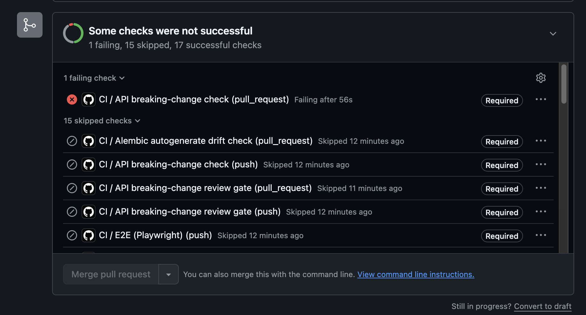
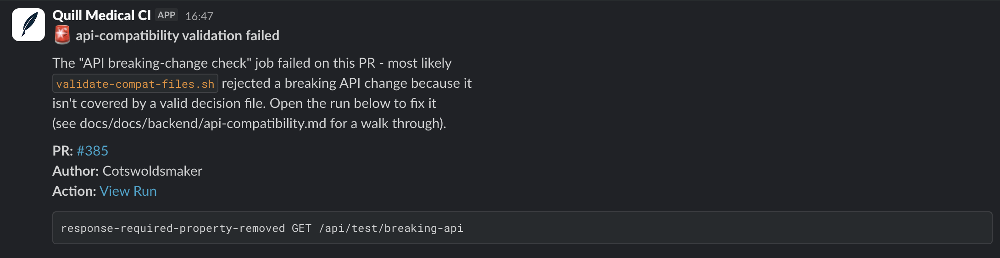

# API compatibility manual testing & validation

## Overview

This guide walks through recreating the full API compatibility workflow locally or in test scenarios: detecting a breaking change, going through the approval gate, creating a decision file, and verifying the CI validation passes.

Use this when:

- Testing the workflow before real breaking changes happen
- Diagnosing why CI validation failed
- Demonstrating the process to a team member

## Prerequisites

Ensure you're on a feature branch (not `main`) with:

```bash
cd /Users/markbailey/github/quillmedical
git checkout -b feature/test-api-compat
```

## Step 1: Trigger a breaking change with the built-in test harness

Don't touch any real endpoint. The repo has a permanent, flag-gated test
harness purpose-built for this — `backend/app/test_api_endpoints.py`,
registered only when `TEST_API_ENDPOINTS_ENABLED=true` (always false in real
deployments; CI sets it true only when dumping specs for this check). It
exposes `GET /api/test/non-breaking-api` (a control endpoint, never mutated)
and `GET /api/test/breaking-api` / `GET /api/test/breaking-api-2` (endpoints
whose response schema you mutate per scenario).

Open [backend/app/test_api_endpoints.py](../../../backend/app/test_api_endpoints.py) and flip one of the mutation
constants near the top from `False` to `True`:

```python
# Flip any of these to True in a test PR to remove that property from its
# response — a genuine response-property-removed breaking change for
# oasdiff to catch.
MUTATE_REMOVE_MESSAGE_1 = True   # ← was False
MUTATE_REMOVE_DETAIL_1 = False
MUTATE_REMOVE_SUMMARY_2 = False
```

Each constant removes one field from the corresponding response model
(`TestBreakingResponse1.message`, `TestBreakingResponse1.detail`, or
`TestBreakingResponse2.summary`) via the `if not MUTATE_...:` guards already
in the model/handler bodies — no other code changes needed. Flipping
`MUTATE_REMOVE_MESSAGE_1` and `MUTATE_REMOVE_DETAIL_1` together produces two
breaking changes on the same endpoint at once, useful for testing partial
decision-file coverage.

Push your change:

```bash
git add backend/app/test_api_endpoints.py
git commit -m "test: mutate breaking-api harness for compat testing"
git push origin feature/test-api-compat
```

## Step 2: Trigger CI and observe the breaking-change detection

Pushing a `feature/**` branch triggers `.github/workflows/auto-pr.yml`, which
auto-creates the PR as a **draft** — by design, this holds back the heavy
tier (including `heavy_api_schema_diff`) entirely; a draft PR shows no
schema-diff check at all, not even a pending one. Click **Ready for review**
on the PR before continuing — that's what actually fires the heavy tier
(`pull_request.ready_for_review`), not the initial push.

The CI workflow will:

1. Generate the OpenAPI spec from your branch
2. Download and diff against the `main` branch spec via `oasdiff breaking`
3. Report any breaking changes found

### Github will report the failure as below



### You will get a slack message similar to the one below when the check fails



**Check the CI logs:**

In the **Checks** tab of your PR, find the `heavy_api_schema_diff` job and click **View workflow run**:

- Look for the step: "Run openapi schema diff"
- The output will show `breaking=true` if your change was detected
- Look for `oasdiff`'s JSON report listing your change (e.g., `"response-required-property-removed"` or `"request-required-property-added"`)

**Expected output snippet** in the job log:

```
...
+++ oasdiff - OpenAPI diff and breaking changes detector
+ oasdiff breaking --format json main.json pr.json > oasdiff-report.json
[check-api-breaking-changes] Detected 1 breaking change(s)
breaking=true
```

## Step 3: Observe the GitHub Actions approval gate

Once CI detects `breaking=true`, GitHub Actions will pause and require approval from the **api-breaking-change-review** environment.

**What you'll see:**

In your PR, a new check appears: "Waiting for approval in api-breaking-change-review environment" (with a clickable link).

Click the environment link or go to **Settings** → **Environments** → **api-breaking-change-review** to see:

- Required reviewers (repo owner/author)
- Deployment summary showing your run awaiting approval
- A blue **Approve and deploy** button

**To approve:**

1. Click **Approve and deploy**
2. (Optional) add a comment explaining the business case for the breaking change
3. Confirm approval

Approving advances the workflow to the next jobs (validation, Slack notification, etc.).

## Step 4: Run the validation script and observe it fail

Before you can merge, the `validate-compat-files.sh` script must pass. It will **fail** if you haven't created a decision file yet.

**To run validation locally:**

```bash
cd /Users/markbailey/github/quillmedical/backend

# Dump the spec for your mutated PR branch (same command + flag CI uses)
TEST_API_ENDPOINTS_ENABLED=true poetry run python scripts/dump_openapi.py --dev
cp ../docs/docs/code/swagger/openapi.json /tmp/pr.json

# Dump the spec for main (stash your mutation, dump, restore it)
git stash
TEST_API_ENDPOINTS_ENABLED=true poetry run python scripts/dump_openapi.py --dev
cp ../docs/docs/code/swagger/openapi.json /tmp/main.json
git stash pop

# Diff the two specs into the JSON report the validator expects
oasdiff breaking --format json /tmp/main.json /tmp/pr.json > /tmp/oasdiff-report.json

# Now run the validation (from repo root)
cd /Users/markbailey/github/quillmedical
bash .github/scripts/ci/validate-compat-files.sh /tmp/oasdiff-report.json api-compatibility
```

**Expected output (failure):**

```
[validate-compat-files] ERROR: Flagged change not covered by any decision file:
'response-required-property-removed GET /api/test/breaking-api'
```

The script lists which exact `oasdiff` change ID + operation + path it found but for which no decision file exists.

## Step 5: Create a decision file

Use the interactive script to create a decision file covering your breaking change:

```bash
python backend/scripts/new_compat_decision.py
```

**Follow the prompts:**

```
Enter the oasdiff change ID + operation + path exactly as it appears in the error:
> response-required-property-removed GET /api/test/breaking-api

Enter forces_reload (true/false) — does this breaking change require every open
tab to reload immediately?

  - true: if a tab's cached data depends on the removed field and will crash or
    malfunction without it
  - false: if the app gracefully handles the missing field (e.g. optional field,
    or the UI doesn't use it)

Enter (true/false):
> false

Enter a reason (for the safety/audit trail):
> Test scenario for the api-compatibility CI harness (see
  docs/docs/plans/2026-08-09-alembic-review-and-revisions-plan.md, item 19,
  Phase 2). MUTATE_REMOVE_MESSAGE_1 removes the "message" field from the
  disposable /api/test/breaking-api endpoint, which is never called by the
  real app — no client, real or stale, depends on it.

```

The script generates a file like:

```yaml
# api-compatibility/20260821120345-breaking-api-message-removal.yaml
generation: 3
forces_reload: false
change: "response-required-property-removed GET /api/test/breaking-api"
reason: 'Test scenario for the api-compatibility CI harness (see docs/docs/plans/2026-08-09-alembic-review-and-revisions-plan.md, item 19, Phase 2). MUTATE_REMOVE_MESSAGE_1 removes the "message" field from the disposable /api/test/breaking-api endpoint, which is never called by the real app — no client, real or stale, depends on it.'
```

## Step 6: Run validation again (expect pass)

```bash
bash .github/scripts/ci/validate-compat-files.sh /tmp/oasdiff-report.json api-compatibility
```

**Expected output (success):**

```
[validate-compat-files] Validation passed (11 rule checks)
```

No errors, exit code 0.

## Step 7: Commit and watch CI pass

```bash
git add api-compatibility/
git commit -m "docs: add decision file for breaking-api message removal (forces_reload=false)"
git push origin feature/test-api-compat
```

Push to the PR. CI re-runs:

- `heavy_api_schema_diff` still detects the breaking change (`breaking=true`)
- `heavy_api_breaking_change_gate` still waits for approval (or auto-skips if you already approved)
- **NEW**: `heavy_api_compat_notify` **does NOT fire** (because validation passed, job succeeds)
- The workflow completes green

## Step 8: Observe Slack notification on validation failure (optional)

To test the **failure path** (Slack alert when validation fails), temporarily remove or corrupt your decision file:

```bash
rm api-compatibility/20260821120345-breaking-api-message-removal.yaml
git add api-compatibility/
git commit -m "test: remove decision file to trigger Slack alert"
git push origin feature/test-api-compat
```

CI runs and validation fails. You'll see:

- `heavy_api_schema_diff` job **fails** (validation step returns non-zero exit code)
- `heavy_api_compat_notify` **fires** and posts to Slack #teaching channel:

```
🚨 api-compatibility validation failed

The "API breaking-change check" job failed on this PR - most likely
validate-compat-files.sh rejected a breaking API change because it
isn't covered by a valid decision file. Open the run below to fix it
(see docs/docs/backend/api-compatibility.md).

PR: #<number>
Author: @<your-username>
Action: View Run

[error output in backticks]
```

Restore your decision file and push again to verify it clears.

## Step 9: Clean up

If this was just a dry run, delete your test branch without merging:

```bash
git checkout main
git branch -D feature/test-api-compat
git push origin --delete feature/test-api-compat
```

Also flip the mutation constant in `test_api_endpoints.py` back to `False` on `main` if it was ever merged there by mistake — it must stay off outside a deliberate test round.

Note: the actual Phase 2 test round tracked in [the Alembic review plan](../plans/2026-08-09-alembic-review-and-revisions-plan.md) does the opposite deliberately — its branch merges to `main` once the gate-approve scenario is proven, so the decision files and the mutated harness become the new permanent baseline rather than being reverted.

## Common errors and fixes

| Error                                                          | Cause                                                          | Fix                                                                                                            |
| -------------------------------------------------------------- | -------------------------------------------------------------- | -------------------------------------------------------------------------------------------------------------- |
| `oasdiff: command not found`                                   | oasdiff not installed                                          | Install: `brew install oasdiff` or download from [oasdiff releases](https://github.com/Tufin/oasdiff/releases) |
| `[validate-compat-files] ERROR: Flagged change not covered...` | Decision file missing or `change:` field doesn't match exactly | Check the error message's exact change string; ensure your decision file's `change:` field matches it verbatim |
| `[validate-compat-files] ERROR: Filename regex mismatch`       | Decision file name is wrong format                             | Use `YYYYMMDDHHMMSS-<slug>.yaml` format (UTC timestamp, no separators, kebab-case slug)                        |
| `[validate-compat-files] ERROR: YAML parsing failed`           | Decision file has invalid YAML syntax                          | Check indentation, quotes, special characters (use `yamllint api-compatibility/<filename>.yaml`)               |
| `[validate-compat-files] ERROR: Stale change string`           | Decision file references a change oasdiff didn't detect        | Check oasdiff output; ensure the `change:` field exactly matches what was found                                |

## Reference: decision file schema

All decision files must have:

```yaml
generation: <positive integer>
forces_reload: <true or false>
change: "<exact oasdiff change ID> <HTTP method> <path>"
reason: "<non-empty explanation for audit trail>"
```

- **`generation`**: assigned by `new_compat_decision.py`; auto-increments; on `forces_reload: true` files, must be globally unique (CI enforces this).
- **`forces_reload`**: human's judgement call — does a stale tab **need** to force-reload, or is the background update sufficient?
- **`change`**: copied verbatim from oasdiff output or CI log; no typos or rewording.
- **`reason`**: compliance artefact — explains the reasoning, not just the outcome.

Once merged to `main`, the `generation`, `forces_reload`, and `change` fields become immutable (for audit trail integrity). The `reason` field may be edited later via another PR if needed.
