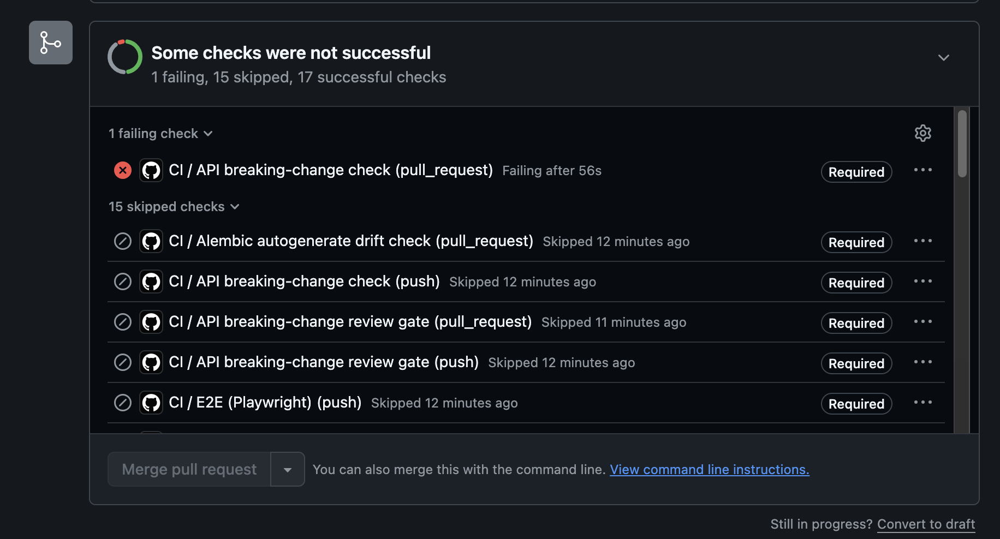
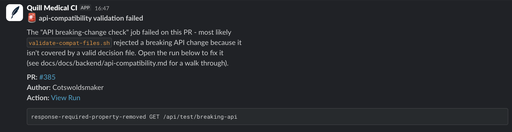
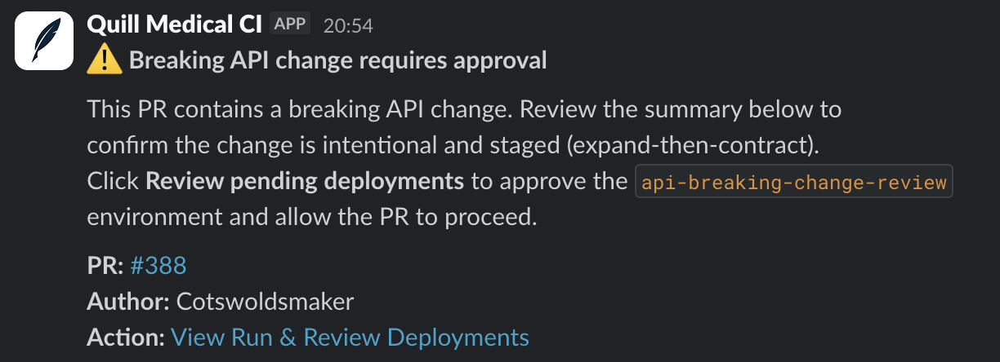
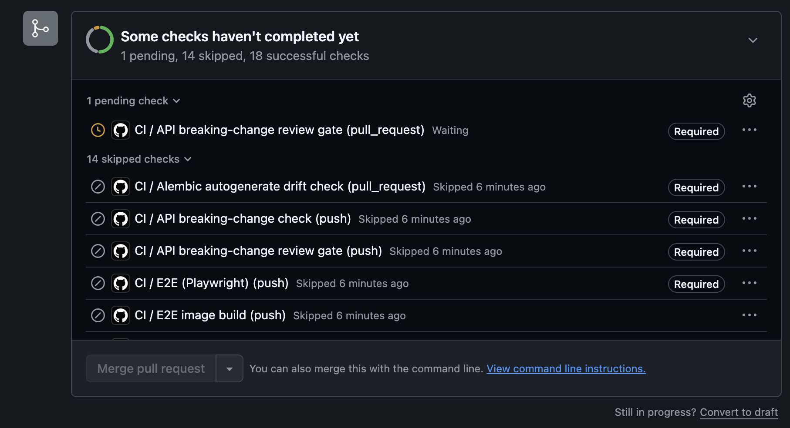
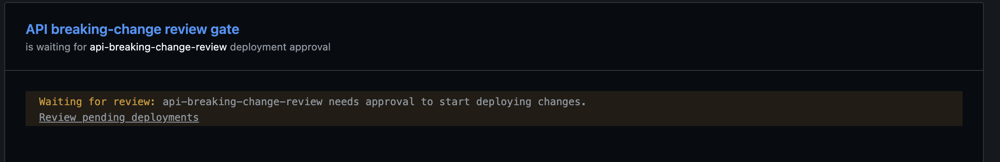
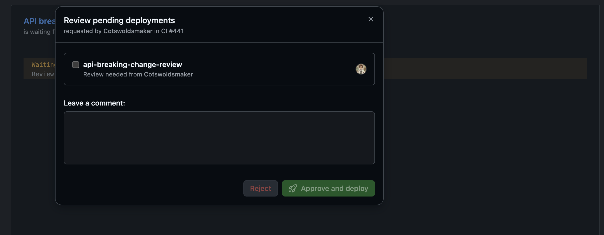

# API compatibility manual testing & validation

## Overview

This guide walks through recreating the full API compatibility workflow locally or in test scenarios: detecting a breaking change, going through the approval gate, creating a decision file, and verifying the CI validation passes.

Use this when:

- Testing the workflow before real breaking changes happen
- Diagnosing why CI validation failed
- Demonstrating the process to a team member

## Prerequisites

Ensure you're on a feature branch (not `main`) with:

```bash
cd /Users/markbailey/github/quillmedical
git checkout -b feature/test-api-compat
```

## Step 1: Trigger a breaking change with the built-in test harness

Don't touch any real endpoint. The repo has a permanent, flag-gated test
harness purpose-built for this - `backend/app/test_api_endpoints.py`,
registered only when `TEST_API_ENDPOINTS_ENABLED=true` (always false in real
deployments; CI sets it true only when dumping specs for this check). It
exposes `GET /api/test/non-breaking-api` (a control endpoint, never mutated)
and `GET /api/test/breaking-api` / `GET /api/test/breaking-api-2` (endpoints
whose response schema you mutate per scenario).

Open [backend/app/test_api_endpoints.py](../../../backend/app/test_api_endpoints.py) and flip one of the mutation
constants near the top from `False` to `True`:

```python
# Flip any of these to True in a test PR to remove that property from its
# response - a genuine response-property-removed breaking change for
# oasdiff to catch.
MUTATE_REMOVE_MESSAGE_1 = True   # ← was False
MUTATE_REMOVE_DETAIL_1 = False
MUTATE_REMOVE_SUMMARY_2 = False
```

Each constant removes one field from the corresponding response model
(`TestBreakingResponse1.message`, `TestBreakingResponse1.detail`, or
`TestBreakingResponse2.summary`) via the `if not MUTATE_...:` guards already
in the model/handler bodies - no other code changes needed. Flipping
`MUTATE_REMOVE_MESSAGE_1` and `MUTATE_REMOVE_DETAIL_1` together produces two
breaking changes on the same endpoint at once, useful for testing partial
decision-file coverage.

Push your change:

```bash
git add backend/app/test_api_endpoints.py
git commit -m "test: mutate breaking-api harness for compat testing"
git push origin feature/test-api-compat
```

## Step 2: Trigger CI and observe the breaking-change detection

Pushing a `feature/**` branch triggers `.github/workflows/auto-pr.yml`, which
auto-creates the PR as a **draft** - by design, this holds back the heavy
tier (including `api_schema_diff`) entirely; a draft PR shows no
schema-diff check at all, not even a pending one. Click **Ready for review**
on the PR before continuing - that's what actually fires the heavy tier
(`pull_request.ready_for_review`), not the initial push.

The CI workflow will:

1. Generate the OpenAPI spec from your branch
2. Generate the spec from the commit your branch started from, and diff the two via `oasdiff breaking`
3. Report any breaking changes found

### Github will report the failure as below



### You will get a slack message similar to the one below when the check fails



**Check the CI logs:**

In the **Checks** tab of your PR, find the `api_schema_diff` job and click **View workflow run**:

- Look for the step: "Check for undeclared breaking API changes"
- The log ends with `Breaking API change(s) detected` if your change was detected
- Above it is `oasdiff`'s report listing your change (e.g., `response-required-property-removed` or `request-required-property-added`)

**Expected output snippet** in the job log:

```
...
[check-api-breaking-changes] ERROR: Breaking API change(s) detected - see the oasdiff report above.
```

## Step 3: Observe the GitHub Actions approval gate

Once CI detects `breaking=true`, GitHub Actions will pause and require approval from the **api-breaking-change-review** environment.

**What you'll see:**

### Slack shows this message



### Github PR looks like this



In your PR, a new check appears: "Waiting for approval in api-breaking-change-review environment" (with a clickable link).

### Approval page

Click the environment link or go to **Settings** → **Environments** → **api-breaking-change-review** to see:



- Required reviewers (repo owner/author)
- Deployment summary showing your run awaiting approval
- A green **Approve and deploy** button

**To approve:**



1. Click **Approve and deploy**
2. (Optional) add a comment explaining the business case for the breaking change
3. Confirm approval

Approving lets the gate job finish. Validation and the Slack notification do not wait for it: both have already run.

## Step 4: Run the validation script and observe it fail

Before you can merge, the `validate-compat-files.sh` script must pass. It will **fail** if you haven't created a decision file yet.

**To run validation locally:**

```bash
cd /Users/markbailey/github/quillmedical/backend

# Dump the spec for your mutated PR branch (same command + flag CI uses)
TEST_API_ENDPOINTS_ENABLED=true poetry run python scripts/dump_openapi.py --dev
cp ../docs/docs/code/swagger/openapi.json /tmp/pr.json

# Dump the spec for main (stash your mutation, dump, restore it)
git stash
TEST_API_ENDPOINTS_ENABLED=true poetry run python scripts/dump_openapi.py --dev
cp ../docs/docs/code/swagger/openapi.json /tmp/main.json
git stash pop

# Diff the two specs into the JSON report the validator expects
oasdiff breaking --format json /tmp/main.json /tmp/pr.json > /tmp/oasdiff-report.json

# Now run the validation (from repo root)
cd /Users/markbailey/github/quillmedical
bash .github/scripts/ci/validate-compat-files.sh /tmp/oasdiff-report.json api-compatibility
```

**Expected output (failure):**

```
[validate-compat-files] Parsing oasdiff output...
[validate-compat-files] Running validation rules...
[validate-compat-files] Checking coverage: 1 flagged change(s) must have matching files...
[validate-compat-files] ERROR: Flagged change not covered by any decision file: 'response-required-property-removed GET /api/test/breaking-api removed the required property `message` from the response with the `200` status'
```

The string in quotes is the change: `oasdiff`'s change ID, the operation, the path and `oasdiff`'s own description, joined by spaces. Copy all of it. A string that stops at the path matches nothing, because the description is what tells two changes on one endpoint apart.

Two things to know before running the validator locally:

- **It needs bash 4 or later.** macOS ships bash 3.2, where the script stops at `declare: -A: invalid option` part-way through its rules. Install a newer one (`brew install bash`) and call that, or run the script on Linux.
- **It reads only decision files committed on the branch.** It finds new files with `git diff` against the branch's base, so a decision file that is written but not yet committed does not count, and the failure above is reported as if it were not there.

## Step 5: Create a decision file

Use the interactive script to create a decision file covering your breaking change:

```bash
python backend/scripts/new_compat_decision.py
```

**Follow the prompts:**

```
Enter the oasdiff-flagged change:
change> response-required-property-removed GET /api/test/breaking-api removed the required property `message` from the response with the `200` status

Explain why you made this forces_reload decision:
reason> Test scenario for the api-compatibility CI harness. MUTATE_REMOVE_MESSAGE_1 removes the "message" field from the disposable /api/test/breaking-api endpoint, which is never called by the real app, so no client, real or stale, depends on it.

Does this change require a forced reload of open tabs? (y/n)
forces_reload> n
```

The script names the file itself, from the time in UTC and the first sixty characters of the reason, and prints where it put it:

```
✓ Decision file created: /Users/markbailey/github/quillmedical/api-compatibility/20261002184153-test-scenario-for-the-api-compatibility-ci-harness-mutate-re.yaml
```

The file holds four lines and nothing else:

```yaml
generation: 1
forces_reload: false
change: "response-required-property-removed GET /api/test/breaking-api removed the required property `message` from the response with the `200` status"
reason: "Test scenario for the api-compatibility CI harness. MUTATE_REMOVE_MESSAGE_1 removes the \"message\" field from the disposable /api/test/breaking-api endpoint, which is never called by the real app, so no client, real or stale, depends on it."
```

`generation` is worked out by the script from the files already there, so yours may differ.

## Step 6: Commit the file and run validation again (expect pass)

Commit first. The validator does not see the file until it is committed:

```bash
git add api-compatibility/
git commit -m "docs: add decision file for breaking-api message removal (forces_reload=false)"
bash .github/scripts/ci/validate-compat-files.sh /tmp/oasdiff-report.json api-compatibility
```

**Expected output (success):**

```
[validate-compat-files] Parsing oasdiff output...
[validate-compat-files] Running validation rules...
[validate-compat-files] Checking coverage: 1 flagged change(s) must have matching files...
[validate-compat-files] Checking reason fields are non-empty...
[validate-compat-files] Checking change fields are single scalars...
[validate-compat-files] Checking immutability of generation/forces_reload/change fields...
[validate-compat-files] Checking for deleted files...
[validate-compat-files] Checking filename regex for new files...
[validate-compat-files] Checking for duplicate generations in forces_reload:true files...
[validate-compat-files] Checking generation range for forces_reload:false files (1 to 0)...
[validate-compat-files] Checking for stale change strings...
[validate-compat-files] All validation rules passed ✓
```

No errors, exit code 0.

## Step 7: Push and watch CI pass

```bash
git push origin feature/test-api-compat
```

Push to the PR. CI re-runs:

- `api_schema_diff` still detects the breaking change (`breaking=true`)
- `api_breaking_change_gate` asks for approval again, because adding the decision file changed the pull request's code
- The workflow completes green

## Step 8: Observe what happens with no decision file (optional)

To test the **failure path**, temporarily remove your decision file:

```bash
rm api-compatibility/20261002184153-test-scenario-for-the-api-compatibility-ci-harness-mutate-re.yaml
git add api-compatibility/
git commit -m "test: remove decision file"
git push origin feature/test-api-compat
```

CI runs and validation fails. You'll see:

- `api_schema_diff` job **fails** (the validation step exits non-zero)
- the gate **still** comments, still posts to Slack and still asks for
  approval - the break is recorded when it appears, not when its paperwork
  catches up
- that Slack message carries the `oasdiff` change string under **Breaking
  changes:**, which is exactly what you paste back into
  `new_compat_decision.py` to fix it
- the failing check keeps the PR blocked regardless of the approval

There is **one** Slack message per gate, sent when a break needs approval -
the same rule as the destructive-migration gate. A validation failure on its
own shows as a red check and nothing more.

Restore your decision file and push again to verify the check clears.

## Step 9: Clean up

If this was just a dry run, delete your test branch without merging:

```bash
git checkout main
git branch -D feature/test-api-compat
git push origin --delete feature/test-api-compat
```

Also flip the mutation constant(s) in `test_api_endpoints.py` back to `False` on `main`, and delete the decision file(s) created for the test round, so the harness stays reusable for future demos. Deleting a decision file requires a temporary bypass of the `validate_no_deletions` CI rule (comment out its call in `validate-compat-files.sh`'s `main()`), restored again in an immediate follow-up PR - see [the Alembic review plan](../plans/2026-08-09-alembic-review-and-revisions-plan.md) for the worked example from the Phase 2 test round.

## Common errors and fixes

| Error                                                                                                          | Cause                                                          | Fix                                                                                                              |
| -------------------------------------------------------------------------------------------------------------- | -------------------------------------------------------------- | ---------------------------------------------------------------------------------------------------------------- |
| `oasdiff: command not found`                                                                                   | oasdiff not installed                                          | Install: `brew install oasdiff` or download from [oasdiff releases](https://github.com/oasdiff/oasdiff/releases) |
| `[validate-compat-files] ERROR: Flagged change not covered...`                                                 | Decision file missing, not yet committed, or `change:` field doesn't match exactly | Commit the file; check the error message's exact change string and ensure your decision file's `change:` field matches it verbatim |
| `declare: -A: invalid option`                                                                                  | The validator was run with macOS's bash 3.2                    | Run it with bash 4 or later (`brew install bash`), or on Linux                                                   |
| `[validate-compat-files] ERROR: File ... does not match required regex`                                        | Decision file name is wrong format                             | Use `YYYYMMDDHHMMSS-<slug>.yaml` format (UTC timestamp, no separators, kebab-case slug)                          |
| `[validate-compat-files] ERROR: YAML parsing failed`                                                           | Decision file has invalid YAML syntax                          | Check indentation, quotes, special characters (use `yamllint api-compatibility/<filename>.yaml`)                 |
| `[validate-compat-files] ERROR: File ... references change '...' which was not flagged by oasdiff in this run` | Decision file references a change oasdiff didn't detect        | Check oasdiff output; ensure the `change:` field exactly matches what was found                                  |

## Reference: decision file schema

All decision files must have:

```yaml
generation: <positive integer>
forces_reload: <true or false>
change: "<exact oasdiff change ID> <HTTP method> <path> <text>"
reason: "<non-empty explanation for audit trail>"
```

- **`generation`**: assigned by `new_compat_decision.py`; auto-increments; on `forces_reload: true` files, must be globally unique (CI enforces this).
- **`forces_reload`**: human's judgement call - does a stale tab **need** to force-reload, or is the background update sufficient?
- **`change`**: copied verbatim from oasdiff output or CI log; no typos or rewording.
- **`reason`**: compliance artefact - explains the reasoning, not just the outcome.

Once merged to `main`, the `generation`, `forces_reload`, and `change` fields become immutable (for audit trail integrity). The `reason` field may be edited later via another PR if needed.
