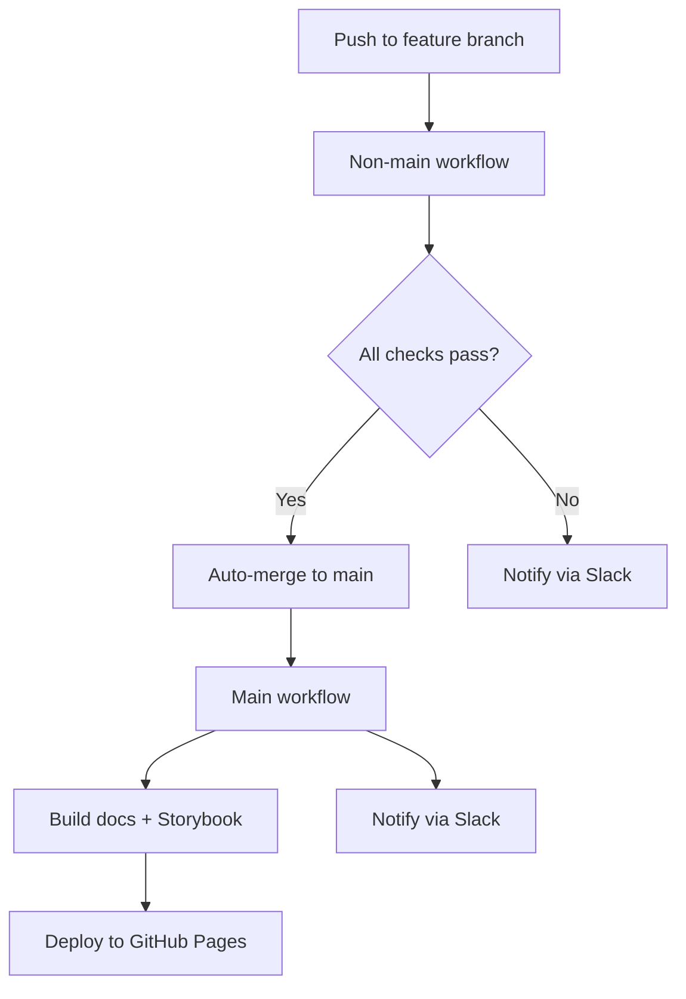
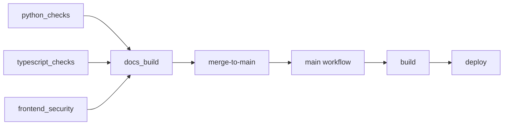

# CI/CD pipeline

**Last updated:** 20 February 2026

Quill Medical uses a dual-workflow GitHub Actions pipeline that automatically validates, tests, and deploys code changes. The pipeline runs comprehensive checks on feature branches and automatically merges passing branches to main, which then builds and deploys documentation to GitHub Pages.

## Pipeline overview



## Workflows

### Non-main workflow

**File:** [`.github/workflows/non-main.yml`](https://github.com/bailey-medics/quillmedical/blob/main/.github/workflows/non-main.yml)

**Triggers:**

- Push to any branch except `main`
- Pull requests to any branch except `main`

**Jobs:**

1. **Python checks** (matrix: `styling`, `unit`)
    - **Styling:** Pre-commit hooks (ruff, black, mypy, bandit, YAML/TOML/JSON validation, cspell)
    - **Unit tests:** pytest for non-integration/non-e2e tests
    - Python 3.13, Poetry dependency management
    - Caches: `.venv`, pre-commit hooks, pip cache

2. **TypeScript checks** (matrix: 7 parallel jobs)
    - **eslint:** JavaScript/TypeScript linting
    - **prettier:** Code formatting
    - **stylelint:** CSS/SCSS linting
    - **typecheck:all:** TypeScript type checking across entire codebase
    - **unit-test:run:** Vitest unit tests
    - **storybook:build:** Build Storybook static site
    - **storybook:test:ci:** Playwright visual regression tests
    - Node 22, Yarn 4.10.3
    - Caches: Yarn dependencies, Playwright browsers, Storybook build artifacts, ESLint cache

3. **Frontend security**
    - Semgrep SAST (Static Application Security Testing)
    - Runs against frontend code with custom rules (`.semgrep.yml`)

4. **Documentation build**
    - Validates that docs build successfully before merging
    - Builds both frontend docs (TypeDoc, Storybook) and backend docs (MkDocs)
    - Ensures OpenAPI schema generation works
    - Depends on: `python_checks`, `typescript_checks`, `frontend_security`

5. **Merge to main**
    - **Only runs on push events** (not PRs)
    - Automatically merges passing branches into `main` with no-fast-forward merge
    - Configured git user: `github-actions[bot]`
    - Aborts on merge conflicts
    - Depends on: `docs_build`

**Concurrency:**

- Group: `nonmain-${{ github.ref }}`
- Cancel in-progress: `true` (cancels older runs when new commits pushed)

**Notifications:**

- Slack webhooks on failure at each job level
- Slack notification on successful merge to main
- Messages include commit SHA, author, and GitHub Actions run link

### Main workflow

**File:** [`.github/workflows/main.yml`](https://github.com/bailey-medics/quillmedical/blob/main/.github/workflows/main.yml)

**Triggers:**

- Push to `main` branch
- Pull requests to `main` branch
- Workflow dispatch (manual trigger)
- Workflow run completion from non-main workflow (when successful)

**Jobs:**

1. **Build**
    - Builds MkDocs documentation site
    - Builds Storybook static site
    - Generates TypeDoc API documentation
    - Exports OpenAPI schema to JSON
    - Copies LLM prompts to docs
    - Creates unified site in `/site` directory
    - Uploads artifact for GitHub Pages
    - Caches: Yarn dependencies, Poetry dependencies, Storybook artifacts

2. **Deploy**
    - Deploys built site to GitHub Pages
    - Extracts commit info (handles merge commits specially)
    - Environment: `github-pages`
    - Depends on: `build`

**Concurrency:**

- Group: `pages`
- Cancel in-progress: `true` (only one Pages deployment at a time)

**Notifications:**

- Slack notification on build success
- Slack notification on build or deployment failure
- Messages extract original commit info from merge commits

## Running checks locally

You can run the same CI checks locally before pushing to GitHub using two complementary approaches:

### Quick iteration (native execution)

**Script:** [`scripts/run-ci-checks.sh`](../../scripts/README.md)

Runs checks natively on your machine without Docker. Fast but may have slight environment differences from GitHub Actions runners.

```bash
# Run all checks
./scripts/run-ci-checks.sh

# Run specific category
./scripts/run-ci-checks.sh python
./scripts/run-ci-checks.sh typescript

# Run individual check
./scripts/run-ci-checks.sh eslint
./scripts/run-ci-checks.sh python-unit
./scripts/run-ci-checks.sh typecheck
```

**Requirements:**

- Python 3.13+
- Node.js 22+
- Yarn 4.10.3
- Poetry (auto-installed if missing)

**Available checks:**

- `all` - All checks (default)
- `python` - All Python checks
- `python-styling` - Pre-commit hooks
- `python-unit` - Pytest unit tests
- `typescript` - All TypeScript checks
- `eslint`, `prettier`, `stylelint` - Individual linters
- `typecheck` - TypeScript type checking
- `unit-tests` - Frontend unit tests
- `storybook-build` - Storybook build
- `storybook-tests` - Storybook visual tests
- `semgrep` - Security scan
- `docs` - Documentation build

### Exact CI environment (Docker via act)

**Script:** [`scripts/run-github-actions-locally.sh`](../../scripts/README.md)

Uses [act](https://github.com/nektos/act) to run the actual GitHub Actions workflows in Docker containers. This is the most accurate way to test, matching the CI environment almost exactly.

```bash
# Install act (macOS)
brew install act

# Ensure Docker is running
open /Applications/Docker.app

# Run entire non-main workflow
./scripts/run-github-actions-locally.sh non-main

# Run specific job
./scripts/run-github-actions-locally.sh non-main python-styling
./scripts/run-github-actions-locally.sh non-main ts-unit

# Run main workflow
./scripts/run-github-actions-locally.sh main
```

**Requirements:**

- Docker Desktop running
- `act` installed (`brew install act`)

**Available jobs:**

Non-main workflow jobs:

- `python-styling` - Pre-commit checks
- `python-unit` - Python unit tests
- `ts-eslint` - ESLint
- `ts-prettier` - Prettier
- `ts-stylelint` - Stylelint
- `ts-typecheck` - TypeScript type checking
- `ts-unit` - Frontend unit tests
- `ts-storybook-build` - Storybook build
- `ts-storybook-test` - Storybook tests
- `semgrep` - Security scan
- `docs` - Documentation build

**Notes:**

- First run downloads container images (~2GB)
- Subsequent runs use cached images
- Secrets in GitHub aren't available locally (use `.secrets` file if needed)

### When to use which approach

| Scenario                              | Use                              |
| ------------------------------------- | -------------------------------- |
| Quick feedback during development     | `run-ci-checks.sh`               |
| Final check before pushing            | `run-ci-checks.sh`               |
| Debugging environment-specific issues | `run-github-actions-locally.sh`  |
| CI passes locally but fails on GitHub | `run-github-actions-locally.sh`  |
| Need exact parity with CI             | `run-github-actions-locally.sh`  |

## Caching strategy

The pipeline uses aggressive caching to improve performance:

### Python checks

- **Pre-commit cache:** Hook installations and environments
- **Poetry venv:** Python dependencies installed via Poetry
- **Pip cache:** Package downloads

**Cache keys:**

- Styling: `pc-styling-{os}-py{version}-{pre-commit-config-hash}`
- Unit: `pc-unit-{os}-py{version}-{poetry-lock-hash}`

### TypeScript checks

- **Yarn cache:** Package downloads and install state
- **node_modules:** Installed dependencies
- **Playwright browsers:** Chromium for Storybook tests
- **Storybook artifacts:** Build cache for faster rebuilds
- **ESLint cache:** Linting results for unchanged files

**Cache keys:**

- Yarn: `{os}-yarn4-nm-{yarn-lock-hash}`
- Playwright: `{os}-playwright-{package-json-hash}`
- Storybook: `{os}-storybook-{src-and-config-hash}`
- ESLint: `{os}-eslint-{files-hash}`

### Documentation builds

- **Yarn dependencies:** Frontend docs tooling
- **Poetry dependencies:** MkDocs and plugins
- **Storybook build:** Reused from TypeScript checks

**Cache keys:**

- Yarn: `{os}-yarn4-docs-{yarn-lock-hash}`
- Poetry: `{os}-poetry-docs-py{version}-{poetry-lock-hash}`
- Storybook: `{os}-storybook-build-{src-hash}`

## Permissions

### Non-main workflow

```yaml
permissions:
  contents: write
```

Required for auto-merge functionality (pushing to main branch).

### Main workflow

```yaml
permissions:
  contents: read
  pages: write
  id-token: write
```

Required for GitHub Pages deployment (OIDC authentication).

## Branch protection

While not enforced via GitHub UI settings, the workflows implement protection through:

1. **Required checks:** All jobs in non-main workflow must pass before merge
2. **Automatic merging:** No manual intervention needed for passing branches
3. **Merge commit strategy:** Always uses `--no-ff` to preserve branch history
4. **Conflict detection:** Aborts merge and fails workflow on conflicts

## Slack notifications

All workflows send notifications to a Slack channel on both success and failure:

**Notification events:**

- ❌ Python checks failure (per matrix job)
- ❌ TypeScript checks failure (per matrix job)
- ❌ Docs build failure
- ❌ Merge failure
- ✅ Successful merge to main
- ✅ Successful docs deployment
- ❌ Docs deployment failure

**Information included:**

- Commit message
- Commit author
- Commit SHA (with link to GitHub)
- GitHub Actions run link
- For merge commits: Original branch SHA (not merge commit SHA)

**Setup:**

Slack webhook URL is stored as a repository secret: `SLACK_WEBHOOK_URL`

## Timeouts

All jobs have explicit timeouts to prevent hung workflows:

- Python checks: 20 minutes
- TypeScript checks: 15 minutes
- Frontend security: 10 minutes
- Documentation build: 20 minutes
- Merge to main: Default (360 minutes)
- Main workflow build: Default (360 minutes)
- Main workflow deploy: Default (360 minutes)

## Troubleshooting

### Checks fail locally but pass in CI

Run the exact CI environment locally:

```bash
./scripts/run-github-actions-locally.sh non-main [job-name]
```

### Checks pass locally but fail in CI

Common causes:

1. **Uncommitted changes:** CI runs against committed code only
2. **Cache differences:** CI uses GitHub's cache, local uses your machine's
3. **Environment variables:** Check `.env` files aren't in `.gitignore`
4. **Node/Python versions:** Ensure local versions match CI (Node 22/24, Python 3.13)

### Merge conflicts

The auto-merge job will abort on conflicts. To resolve:

1. Fetch latest main: `git fetch origin main`
2. Merge main into your branch: `git merge origin/main`
3. Resolve conflicts locally
4. Push resolved branch: `git push`
5. Workflow will retry merge automatically

### Documentation build failures

Check that all required files exist:

- OpenAPI schema generation: `backend/scripts/dump_openapi.py --dev`
- Frontend docs: `yarn docs:build` in `frontend/`
- Storybook: `yarn storybook:build` in `frontend/`
- MkDocs: `mkdocs build` from `backend/` with `-f ../docs/mkdocs.yml`

### Cache issues

If caches become corrupted:

1. **GitHub UI:** Go to Actions → Caches → Delete specific cache
2. **Force rebuild:** Push with `[skip cache]` in commit message (not implemented, delete cache manually)
3. **Local:** Delete `.venv`, `node_modules`, `.yarn/cache` and reinstall

## Workflow dependencies



## Performance metrics

Typical run times (with warm caches):

- **Python styling:** ~30s
- **Python unit tests:** ~1m
- **TypeScript checks:** ~1-3m per job (7 parallel)
- **Frontend security:** ~30s
- **Documentation build:** ~3-5m
- **Total non-main workflow:** ~5-8m
- **Main workflow (build + deploy):** ~5-10m

**Cold cache times:**

- First run can take 10-15m for non-main workflow
- Package installation dominates cold cache time
- Subsequent runs benefit from GitHub Actions cache

## Security considerations

1. **Secrets:** Never logged or exposed in workflow outputs
2. **SLACK_WEBHOOK_URL:** Stored as encrypted repository secret
3. **GitHub token:** Automatically provided via `GITHUB_TOKEN`, scoped per workflow
4. **Permissions:** Minimal required permissions for each workflow
5. **Dependency scanning:** Semgrep runs on every push
6. **Code analysis:** Pre-commit hooks include bandit (Python security linter)

## Future improvements

- [ ] Add integration tests to pipeline
- [ ] Add E2E tests with Playwright
- [ ] Implement deployment to staging environment
- [ ] Add performance benchmarking (Lighthouse CI)
- [ ] Add coverage reporting (Codecov or similar)
- [ ] Add dependency vulnerability scanning (Dependabot/Snyk)
- [ ] Implement semantic versioning and automated releases
- [ ] Add Docker image builds for production deployments

## Related documentation

- [Local CI testing scripts](../../scripts/README.md)
- [Pre-commit hooks configuration](https://github.com/bailey-medics/quillmedical/blob/main/.pre-commit-config.yaml)
- [Semgrep rules](https://github.com/bailey-medics/quillmedical/blob/main/frontend/.semgrep.yml)
- [MkDocs configuration](https://github.com/bailey-medics/quillmedical/blob/main/docs/mkdocs.yml)
- [GitHub Pages site](https://bailey-medics.github.io/quillmedical/)
