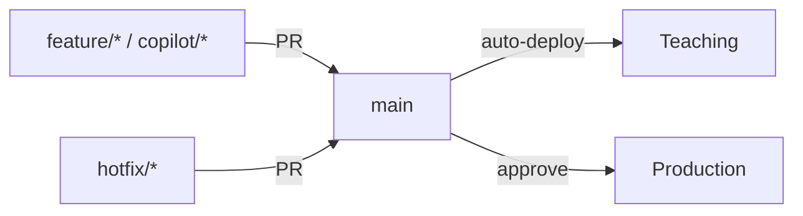
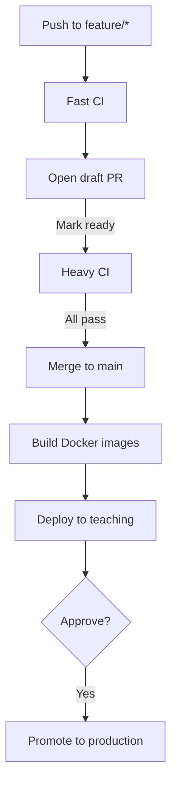

# CI/CD pipeline

**Last updated:** 25 May 2026

Quill Medical uses a trunk-based branching strategy with a single protected branch (`main`). GitHub Actions workflows validate, test, and deploy code changes. Feature branches open PRs to `main`, which auto-deploys to teaching on merge. Production deploys the same image via a GitHub Environment approval gate.

## Branching strategy


```mermaid
graph LR
    A["feature/* / copilot/*"] -->|PR| B[main]
    C[hotfix/*] -->|PR| B
    B -->|auto-deploy| D[Teaching]
    B -->|approve| E[Production]
```

- **`feature/*`** — individual feature/fix branches; CI runs checks and opens a draft PR to `main`
- **`copilot/*`** — AI-generated branches; same CI pipeline as `feature/*`
- **`hotfix/*`** — urgent fixes; same CI pipeline
- **`renovate/*`** — automated dependency updates; same CI pipeline
- **`main`** — the only long-lived branch; auto-deploys to teaching on merge

## Pipeline overview


```mermaid
graph TD
    A["Push to feature/*"] --> B[Fast CI]
    B --> C[Open draft PR]
    C -->|Mark ready| D[Heavy CI]
    D -->|All pass| E[Merge to main]
    E --> F[Build Docker images]
    F --> G[Deploy to teaching]
    G --> H{Approve?}
    H -->|Yes| I[Promote to production]
```

## Test tiering

CI is split into two tiers to give fast feedback on every push while reserving expensive checks for merge-ready code.

### Fast tier (every push)

Runs on every push to any non-`main` branch. Gives feedback in ~2 minutes.

| Job                          | Check name                            | What it does                                                         |
| ---------------------------- | ------------------------------------- | -------------------------------------------------------------------- |
| Python styling               | `Python styling`                      | Pre-commit hooks (ruff, black, mypy, bandit, cspell, YAML/TOML/JSON) |
| Python unit                  | `Python unit`                         | pytest (excludes integration and e2e markers)                        |
| TypeScript (eslint)          | `typescript_checks (eslint)`          | ESLint                                                               |
| TypeScript (prettier)        | `typescript_checks (prettier)`        | Prettier formatting                                                  |
| TypeScript (stylelint)       | `typescript_checks (stylelint)`       | CSS linting                                                          |
| TypeScript (typecheck)       | `typescript_checks (typecheck:all)`   | TypeScript strict compilation                                        |
| TypeScript (unit tests)      | `typescript_checks (unit-test:run)`   | Vitest unit tests                                                    |
| TypeScript (storybook build) | `typescript_checks (storybook:build)` | Storybook static build                                               |

### Heavy tier (non-draft PRs only)

Runs when a PR is marked ready for review or updated. Takes ~5–10 minutes.

| Job                         | Check name                              | What it does                                   |
| --------------------------- | --------------------------------------- | ---------------------------------------------- |
| Storybook interaction tests | `typescript_checks (storybook:test:ci)` | Playwright interaction tests against Storybook |
| Semgrep                     | `Semgrep (frontend SAST)`               | Static application security testing            |
| E2E                         | `E2E (Playwright)`                      | Full-stack end-to-end tests via Docker Compose |

### Draft PR mechanism

The fast tier's `open-pr` job auto-creates a **draft** PR for `feature/*` and `copilot/*` branches. Heavy checks only fire when the PR is marked "Ready for review" (via `pull_request.ready_for_review` event). This means:

- Push to branch → fast checks run (~2 min)
- Mark PR ready → heavy checks run (~5–10 min)
- All 11 checks pass → merge button enabled

## Workflows

### Branch CI (`branch-ci.yml`)

**Triggers:**

- `push` to any branch except `main` (fast tier)
- `pull_request` types `ready_for_review` and `synchronize` targeting `main` (heavy tier)

**Concurrency:** `feature-${{ github.ref }}` with cancel-in-progress (newer pushes cancel older runs).

### Deploy (`deploy.yml`)

**Triggers:**

- Push to `main` (auto-deploy to teaching)
- `workflow_dispatch` with optional `ref` input (for hotfix deploys)

**Jobs:**

1. **Prepare** — resolve build ref, detect changed services
2. **Build** — build Docker images tagged with commit SHA, push to Artifact Registry (GHA layer cache)
3. **Deploy teaching** — update Cloud Run services, smoke test `/api/health`
4. **Create tag** — annotated CalVer tag after successful deploy
5. **Promote to production** — copies the same image to production AR, deploys to production Cloud Run _(gated by GitHub Environment approval; currently disabled while production is spun down)_

**Key design:** build-once-promote. The same Docker image SHA deployed to teaching is promoted to production — no rebuild.

### Documentation (`docs.yml`)

**Triggers:** Push to `main` when docs/backend/frontend/shared files change.

Builds MkDocs + TypeDoc + Storybook + OpenAPI and deploys to GitHub Pages.

### Terraform (`terraform.yml`)

**Triggers:** Push/PR to `main` when `infra/**` changes.

- PRs: `terraform plan` posted as comment
- Push to `main`: `terraform apply` for staging and teaching

## Branch protection

Managed via Terraform in `infra/github/branch_rules.tf`.

**Rules on `main`:**

| Rule                   | Setting                                            |
| ---------------------- | -------------------------------------------------- |
| PR required            | Yes (0 approvals while solo dev)                   |
| Required status checks | All 11 checks (strict — branch must be up-to-date) |
| Force push             | Blocked                                            |
| Branch deletion        | Blocked                                            |
| Bypass actors          | None                                               |

**Branch naming:**

All branches must match `^(feature|hotfix|copilot|renovate)/.+` — enforced at creation time.

## Docker build

The backend Dockerfile has three stages: `dev`, `prod`, and `admin`. Deploy workflows **must** specify `target: prod`:

```yaml
- name: Build image
  uses: docker/build-push-action@v7
  with:
    target: prod
```

The `admin` stage is the last stage — building without `--target` produces the admin CLI, not the web server.

## Secrets

| Secret                         | Purpose                                       |
| ------------------------------ | --------------------------------------------- |
| `GCP_TEACHING_WIF_PROVIDER`    | Workload Identity Federation for teaching     |
| `GCP_TEACHING_SERVICE_ACCOUNT` | Teaching deploy service account               |
| `GCP_TEACHING_PROJECT_ID`      | Teaching GCP project ID                       |
| `GCP_PROD_WIF_PROVIDER`        | WIF for production _(not yet active)_         |
| `GCP_PROD_SERVICE_ACCOUNT`     | Production service account _(not yet active)_ |
| `GCP_PROD_PROJECT_ID`          | Production GCP project ID _(not yet active)_  |

Authentication uses **Workload Identity Federation** — no long-lived service account keys.

## Troubleshooting

### Checks fail locally but pass in CI (or vice versa)

Run the same commands as CI:

```bash
# Python
pre-commit run --all-files
cd backend && poetry run pytest -m "not integration and not e2e"

# TypeScript
cd frontend && yarn eslint && yarn prettier:check && yarn typecheck:all && yarn unit-test:run
```

### PR not created automatically

The `open-pr` job only runs on push to `feature/*` or `copilot/*`. Check the branch name matches and all fast checks passed.

### Teaching not deploying

Deploy triggers on push to `main` only. Check the PR was merged (not just closed) and changes weren't docs-only (paths-ignore applies).
