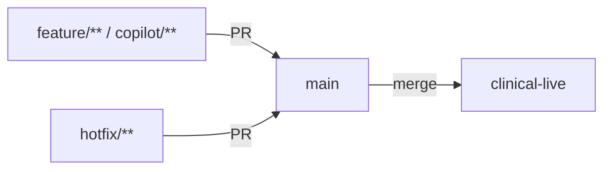
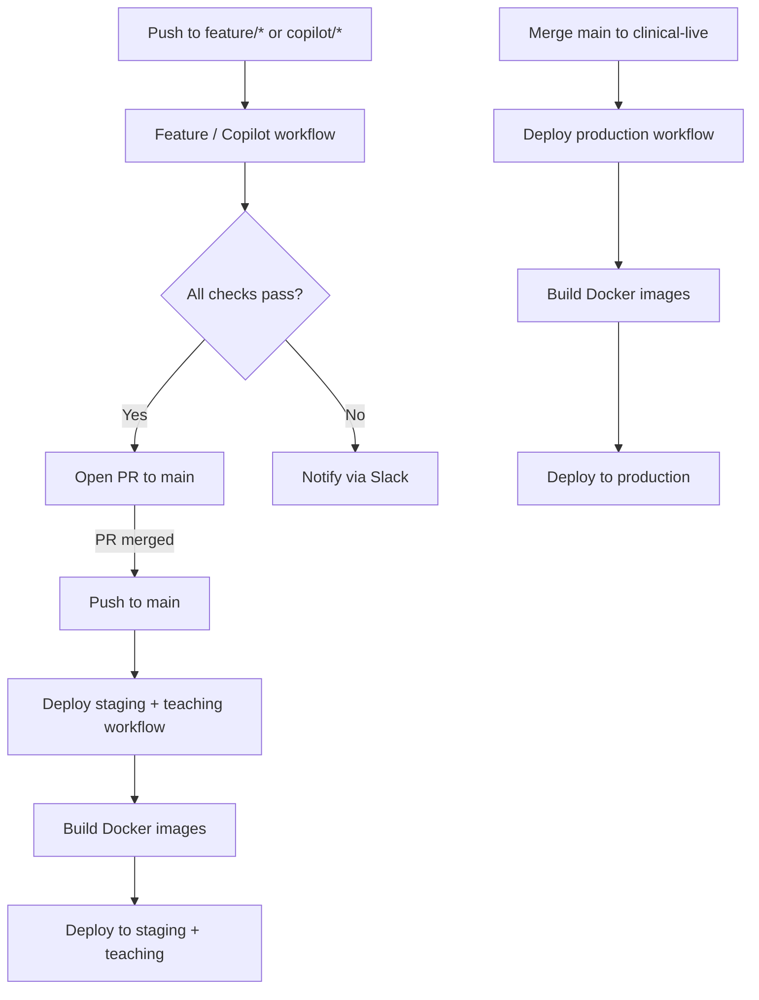
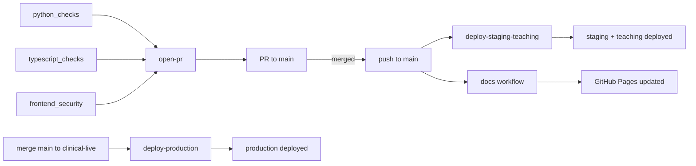

# CI/CD pipeline

**Last updated:** 24 March 2026

Quill Medical uses a trunk-based branching strategy with GitHub Actions workflows that automatically validate, test, and deploy code changes. Feature and Copilot branches open PRs to `main`, which auto-deploys to staging and teaching. Production deploys from `clinical-live`.

## Branching strategy


```mermaid
graph LR
    A["feature/** / copilot/**"] -->|PR| B[main]
    C[hotfix/**] -->|PR| B
    B -->|merge| D[clinical-live]
```

- **`feature/*`** — individual feature/fix branches; CI runs checks and opens a PR to `main`
- **`copilot/*`** — AI-generated branches; same CI pipeline as `feature/*`
- **`hotfix/*`** — urgent production fixes; same CI pipeline with additional docs build
- **`release/**`** — release candidate branches; CI runs the release-hotfix workflow, but releases typically promote via `main`→`clinical-live`
- **`main`** — integration branch; auto-deploys to staging + teaching on merge
- **`clinical-live`** — production-ready code; only receives merges from `main`; auto-deploys to production

## Pipeline overview


```mermaid
graph TD
    A["Push to feature/* or copilot/*"] --> B[Feature / Copilot workflow]
    B --> C{All checks pass?}
    C -->|Yes| D[Open PR to main]
    C -->|No| E[Notify via Slack]
    D -->|PR merged| F[Push to main]
    F --> G[Deploy staging + teaching workflow]
    G --> H[Build Docker images]
    H --> I[Deploy to staging + teaching]
    J[Merge main to clinical-live] --> K[Deploy production workflow]
    K --> L[Build Docker images]
    L --> M[Deploy to production]
```

## Workflows

### Branch CI workflow

**File:** [`.github/workflows/branch-ci.yml`](https://github.com/bailey-medics/quillmedical/blob/main/.github/workflows/branch-ci.yml)

**Triggers:**

- Push to any branch except `main`, `clinical-live`, `release/**`, and `hotfix/**`
- Covers: `feature/*`, `copilot/*`, `renovate/*`, `dependabot/*`, and any other development branch

**Jobs:**

1. **Python checks** (matrix: `styling`, `unit`)
   - **Styling:** Pre-commit hooks (ruff, black, mypy, bandit, YAML/TOML/JSON validation, cspell)
   - **Unit tests:** pytest for non-integration/non-e2e tests
   - Python 3.13, Poetry dependency management
   - Caches: `.venv`, pre-commit hooks, pip cache

2. **TypeScript checks** (matrix: 7 parallel jobs)
   - **eslint:** JavaScript/TypeScript linting
   - **prettier:** Code formatting
   - **stylelint:** CSS/SCSS linting
   - **typecheck:all:** TypeScript type checking across entire codebase
   - **unit-test:run:** Vitest unit tests
   - **storybook:build:** Build Storybook static site
   - **storybook:test:ci:** Playwright visual regression tests
   - Node 22, Yarn 4.10.3
   - Caches: Yarn dependencies, Playwright browsers, Storybook build artifacts, ESLint cache

3. **Frontend security**
   - Semgrep SAST (Static Application Security Testing)
   - Runs against frontend code with custom rules (`.semgrep.yml`)

4. **Open PR**
   - **Only runs on push events** (not PRs)
   - Automatically opens a pull request to `main` if one doesn't already exist
   - Uses latest commit message as the PR title
   - Configured git user: `github-actions[bot]`
   - Depends on: all checks passing

**Concurrency:**

- Group: `feature-${{ github.ref }}`
- Cancel in-progress: `true` (cancels older runs when new commits pushed)

**Notifications:**

- Slack webhooks on failure at each job level
- Messages include commit SHA, author, and GitHub Actions run link

### Release and hotfix workflow

**File:** [`.github/workflows/release-hotfix.yml`](https://github.com/bailey-medics/quillmedical/blob/main/.github/workflows/release-hotfix.yml)

**Triggers:**

- Push to `release/**` or `hotfix/**`

**Jobs:**

Same checks as the feature workflow (python_checks, typescript_checks, frontend_security), plus:

- **Documentation build** — Validates that docs build successfully; builds both frontend docs (TypeDoc, Storybook) and backend docs (MkDocs); ensures OpenAPI schema generation works

### Deploy staging and teaching

**File:** [`.github/workflows/deploy-staging-teaching.yml`](https://github.com/bailey-medics/quillmedical/blob/main/.github/workflows/deploy-staging-teaching.yml)

**Triggers:**

- Push to `main` branch
- Workflow dispatch (manual trigger)

**Jobs:**

1. **Build Docker images**
   - Detect which services changed → only build affected images
   - Build and push to GCP Artifact Registry (staging + teaching registries)
   - Uses `target: prod` Dockerfile stage
   - Skip if only docs changed

2. **Deploy to staging**
   - Authenticate to GCP via Workload Identity Federation
   - Deploy updated Cloud Run services to staging
   - Smoke test `staging.quill-medical.com/api/health` (5 retries, 10 second intervals)

3. **Deploy to teaching**
   - Authenticate to GCP via Workload Identity Federation
   - Deploy updated Cloud Run services to teaching
   - Smoke test `teaching.quill-medical.com/api/health` (5 retries, 10 second intervals)

4. **Notify** — Slack notification on success or failure

**Concurrency:**

- Group: `deploy-staging`
- Cancel in-progress: `true`

### Deploy production

**File:** [`.github/workflows/deploy-production.yml`](https://github.com/bailey-medics/quillmedical/blob/main/.github/workflows/deploy-production.yml)

**Triggers:**

- Push to `clinical-live` branch
- Workflow dispatch (manual trigger)
- Ignores changes to `docs/**`, `*.md`, `safety/**`, `.github/prompts/**`

**Jobs:**

1. **Build Docker images**
   - Build and push to GCP Artifact Registry (production registry)
   - Images tagged as `clinical-live-<sha>` and `latest`
   - Uses `target: prod` Dockerfile stage

2. **Deploy to production**
   - Authenticate to GCP via Workload Identity Federation
   - Deploy updated Cloud Run services to production
   - Smoke test `app.quill-medical.com/api/health`

**Concurrency:**

- Group: `deploy-production`
- Cancel in-progress: `false` (never cancel a production deploy)

### Documentation workflow

**File:** [`.github/workflows/docs.yml`](https://github.com/bailey-medics/quillmedical/blob/main/.github/workflows/docs.yml)

**Triggers:**

- Push to `main` when backend, frontend, docs, shared, or prompt files change

**Jobs:**

1. **Build docs**
   - Builds MkDocs documentation site
   - Builds Storybook static site
   - Generates TypeDoc API documentation
   - Exports OpenAPI schema to JSON
   - Copies LLM prompts to docs
   - Creates unified site in `/site` directory
   - Uploads artifact for GitHub Pages

2. **Deploy docs**
   - Deploys built site to GitHub Pages
   - Environment: `github-pages`

### Terraform workflow

**File:** [`.github/workflows/terraform.yml`](https://github.com/bailey-medics/quillmedical/blob/main/.github/workflows/terraform.yml)

**Triggers:**

- Pull requests to `main` or `clinical-live` (changes to `infra/`)
- Push to `main` or `clinical-live` (changes to `infra/`)

**Jobs:**

1. **Plan** (on PRs) — runs `terraform plan` for staging, teaching, and production; posts plan output as a PR comment
2. **Apply staging + teaching** (on push to `main`) — runs `terraform apply` for both environments
3. **Apply production** (on push to `clinical-live`) — runs `terraform apply` for production

Each job authenticates via Workload Identity Federation with the environment-specific service account.

## Permissions

### Feature / Copilot workflow

```yaml
permissions:
  contents: read
  pull-requests: write
```

Read-only contents access; write access to pull requests required for auto-PR creation.

### Deploy staging and teaching / Deploy production workflows

```yaml
permissions:
  contents: read
  id-token: write
```

Required for GCP deployment via Workload Identity Federation (OIDC).

### Documentation workflow

```yaml
permissions:
  contents: read
  pages: write
  id-token: write
```

Required for GitHub Pages deployment (OIDC authentication).

## Docker build targets

The backend Dockerfile has three stages: `dev`, `prod`, and `admin`. The `admin` stage is the **last stage**, which means building without an explicit `--target` produces the admin CLI image instead of the web server.

All deploy workflows **must** specify `target: prod` in the Docker build step:

```yaml
- name: Build image
  uses: docker/build-push-action@v6
  with:
    target: prod # Must be explicit — default (admin) is not the web server
```

## Branch protection

### `main` branch

1. **PR required:** All changes must come through a reviewed pull request
2. **Required status checks:** All 10 CI checks must pass (strict — branch must be up-to-date)
3. **No direct pushes:** Enforced via GitHub ruleset
4. **Auto-deploy:** Push to `main` triggers staging + teaching deploy

### `clinical-live` branch

1. **PR required:** Receives merges from `main` only
2. **No direct pushes:** Enforced via GitHub ruleset
3. **Auto-deploy:** Push to `clinical-live` triggers production deploy

## Required status checks

All 10 checks must pass before a PR can merge to `main`:

### Python checks

| Check name       | What it does                                                                                              |
| ---------------- | --------------------------------------------------------------------------------------------------------- |
| `Python styling` | Runs pre-commit hooks (ruff, black, mypy, bandit, cspell, trailing whitespace, YAML/TOML/JSON validation) |
| `Python unit`    | Runs `pytest` (excludes integration and e2e markers)                                                      |

### TypeScript checks

| Check name                              | What it does                                      |
| --------------------------------------- | ------------------------------------------------- |
| `typescript_checks (eslint)`            | ESLint on frontend source                         |
| `typescript_checks (prettier)`          | Prettier formatting check                         |
| `typescript_checks (stylelint)`         | CSS/SCSS linting                                  |
| `typescript_checks (typecheck:all)`     | TypeScript strict mode compilation                |
| `typescript_checks (unit-test:run)`     | Vitest unit tests                                 |
| `typescript_checks (storybook:build)`   | Storybook static build succeeds                   |
| `typescript_checks (storybook:test:ci)` | Storybook interaction tests (Playwright/Chromium) |

### Security checks

| Check name                | What it does                                      |
| ------------------------- | ------------------------------------------------- |
| `Semgrep (frontend SAST)` | Static analysis security testing on frontend code |

## Slack notifications

All workflows send notifications to a Slack channel on both success and failure:

**Notification events:**

- ❌ Python checks failure (per matrix job)
- ❌ TypeScript checks failure (per matrix job)
- ❌ Frontend security failure
- ❌ Documentation build failure
- ✅ Successful staging + teaching deployment
- ✅ Successful production deployment
- ✅ Successful docs deployment
- ❌ Staging/teaching deployment failure
- ❌ Production deployment failure
- ❌ Docs deployment failure

**Information included:**

- Commit message
- Commit author
- Commit SHA (with link to GitHub)
- GitHub Actions run link

**Setup:**

Slack webhook URL is stored as a repository secret: `SLACK_WEBHOOK_URL`

## Timeouts

All jobs have explicit timeouts to prevent hung workflows:

- Python checks: 20 minutes
- TypeScript checks: 15 minutes
- Frontend security: 10 minutes
- Documentation build: 20 minutes
- Deploy jobs: Default (360 minutes)

## Troubleshooting

### Checks fail locally but pass in CI

Check that you are running the same commands as CI:

```bash
# Python styling
pre-commit run --all-files

# Python unit tests
cd backend && poetry run pytest -m "not integration and not e2e"

# TypeScript checks
cd frontend && yarn eslint && yarn prettier:check && yarn typecheck:all && yarn unit-test:run
```

### PR not created automatically

The `open-pr` job only runs on push events to `feature/**` or `copilot/**`. Check:

1. Branch name matches `feature/**` or `copilot/**`
2. All CI checks passed
3. No existing open PR from the same branch to `main`

### Staging/teaching not deploying

The deploy workflow only triggers on push to `main`. Check:

1. PR was merged to `main` (not just closed)
2. Changes were to `backend/**`, `frontend/**`, or `shared/**` (not docs-only)
3. Workflow shows in GitHub Actions → `Deploy to staging and teaching`

### Production not deploying

The production deploy triggers on push to `clinical-live`. Check:

1. `main` changes were merged forward to `clinical-live`
2. Changes were not docs-only
3. Workflow shows in GitHub Actions → `Deploy to production`

### Documentation build failures

Check that all required files exist:

- OpenAPI schema generation: `backend/scripts/dump_openapi.py --dev`
- Frontend docs: `yarn docs:build` in `frontend/`
- Storybook: `yarn storybook:build` in `frontend/`
- MkDocs: `mkdocs build` from `backend/` with `-f ../docs/mkdocs.yml`

## Release process

1. **Feature development:** Create `feature/my-feature` branch, develop, push → CI runs, PR opens to `main`
2. **Code review:** Review and merge PR to `main` → staging + teaching deploy automatically
3. **Verify on staging:** Test changes on staging environment
4. **Promote to production:** Merge `main` into `clinical-live` → production deploy automatically

## Workflow dependencies


```mermaid
graph LR
    A[python_checks] --> D[open-pr]
    B[typescript_checks] --> D
    C[frontend_security] --> D
    D --> E[PR to main]
    E -->|merged| F[push to main]
    F --> G[deploy-staging-teaching]
    G --> H[staging + teaching deployed]
    F --> I[docs workflow]
    I --> J[GitHub Pages updated]
    K[merge main to clinical-live] --> L[deploy-production]
    L --> M[production deployed]
```

## Performance metrics

Typical run times (with warm caches):

- **Python styling:** ~30s
- **Python unit tests:** ~1m
- **TypeScript checks:** ~1-3m per job (7 parallel)
- **Frontend security:** ~30s
- **Total feature workflow:** ~5-8m
- **Deploy staging + teaching:** ~5-10m
- **Deploy production:** ~5-10m
- **Documentation build + deploy:** ~3-5m

**Cold cache times:**

- First run can take 10-15m for the feature/copilot workflow
- Package installation dominates cold cache time
- Subsequent runs benefit from GitHub Actions cache

## Security considerations

1. **Secrets:** Never logged or exposed in workflow outputs
2. **SLACK_WEBHOOK_URL:** Stored as encrypted repository secret
3. **GitHub token:** Automatically provided via `GITHUB_TOKEN`, scoped per workflow
4. **Permissions:** Minimal required permissions for each workflow
5. **Dependency scanning:** Semgrep runs on every push
6. **Code analysis:** Pre-commit hooks include bandit (Python security linter)

## Related documentation

- [GitHub configuration and rulesets](../github/)
- [Pre-commit hooks configuration](https://github.com/bailey-medics/quillmedical/blob/main/.pre-commit-config.yaml)
- [Semgrep rules](https://github.com/bailey-medics/quillmedical/blob/main/frontend/.semgrep.yml)
- [MkDocs configuration](https://github.com/bailey-medics/quillmedical/blob/main/docs/mkdocs.yml)
- [GitHub Pages site](https://bailey-medics.github.io/quillmedical/)
