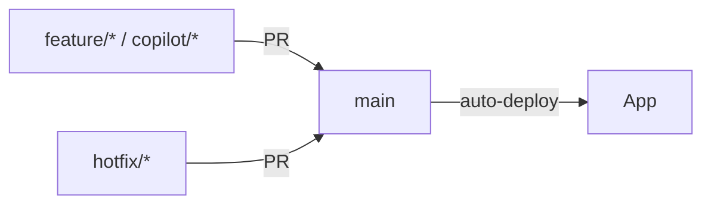
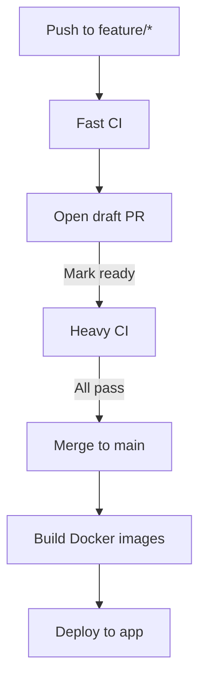

# CI/CD pipeline

Quill Medical uses a trunk-based branching strategy with a single protected branch (`main`). GitHub Actions workflows validate, test, and deploy code changes. Feature branches open PRs to `main`, which auto-deploys to the app environment on merge.

## Branching strategy


```mermaid
graph LR
    A["feature/* / copilot/*"] -->|PR| B[main]
    C[hotfix/*] -->|PR| B
    B -->|auto-deploy| D[App]
```

- **`feature/*`** – individual feature/fix branches; CI runs checks and opens a draft PR to `main`
- **`copilot/*`** – AI-generated branches; same CI pipeline as `feature/*`
- **`hotfix/*`** – urgent fixes; same CI pipeline
- **`renovate/*`** – automated dependency updates; same CI pipeline
- **`main`** – the only long-lived branch; auto-deploys to the app environment on merge

## Pipeline overview


```mermaid
graph TD
    A["Push to feature/*"] --> B[Fast CI]
    B --> C[Open draft PR]
    C -->|Mark ready| D[Heavy CI]
    D -->|All pass| E[Merge to main]
    E --> F[Build Docker images]
    F --> G[Deploy to app]
```

## Test tiering

CI is split into two tiers to give fast feedback on every push while reserving expensive checks for merge-ready code.

### Fast tier (every push)

Runs on every push to any non-`main` branch. Gives feedback in ~2 minutes.

| Job                          | Check name                            | What it does                                                         |
| ---------------------------- | ------------------------------------- | -------------------------------------------------------------------- |
| Python pre-commit            | `Python pre-commit`                   | Pre-commit hooks (ruff, black, mypy, bandit, cspell, YAML/TOML/JSON) |
| Python unit                  | `Python unit`                         | pytest (excludes integration and e2e markers)                        |
| TypeScript (eslint)          | `typescript_checks (eslint)`          | ESLint                                                               |
| TypeScript (prettier)        | `typescript_checks (prettier)`        | Prettier formatting                                                  |
| TypeScript (stylelint)       | `typescript_checks (stylelint)`       | CSS linting                                                          |
| TypeScript (typecheck)       | `typescript_checks (typecheck:all)`   | TypeScript strict compilation                                        |
| TypeScript (unit tests)      | `typescript_checks (unit-test:run)`   | Vitest unit tests, in three legs (`Frontend unit tests (1/3)` on)    |
| TypeScript (storybook build) | `typescript_checks (storybook:build)` | Storybook static build                                               |

### Heavy tier (non-draft PRs only)

Runs when a PR is marked ready for review or updated. Takes ~5–10 minutes.

| Job                         | Check name                    | What it does                                   |
| --------------------------- | ----------------------------- | ---------------------------------------------- |
| Storybook interaction tests | `Storybook interaction tests` | Playwright interaction tests against Storybook |
| Semgrep                     | `Semgrep (frontend SAST)`     | Static application security testing            |
| E2E                         | `E2E (Playwright)`            | Full-stack end-to-end tests via Docker Compose |

The Storybook tests run as three legs, `Storybook interaction tests (1/3)` to
`(3/3)`, each running a third of the stories against its own Storybook. The
check named `Storybook interaction tests` is a small job that passes only when
all three did, and it is the one branch protection requires.

Both the Storybook legs and the E2E job run their tests in Microsoft's
Playwright image, which carries the browsers and their system packages, so
neither installs anything on the runner. The image tag is the installed
`@playwright/test` version.

`E2E image build` reads a Docker layer cache and never writes one.
`.github/workflows/e2e-image-cache.yml` saves it from `main`, because a cache
saved on a pull request can be read by that pull request alone.

### Shell script tests

Shell scripts that back the GitHub Actions workflows live under `.github/scripts/<workflow-name>/`. Any script with non-trivial logic has a [bats](https://github.com/bats-core/bats-core) (Bash Automated Testing System) test file alongside it – e.g. `deploy/resolve-commit.bats` sits next to `deploy/resolve-commit.sh`.

- **Run locally:** `just test-scripts` (alias `ts`) – runs the suite inside `ubuntu:24.04`, the same image, bats version and invocation as CI. Needs Docker running; bats itself is not installed on the host.
- **Why the container:** the scripts run on `ubuntu-24.04` runners, so a host run tests a different bash, coreutils and `sha256sum`. `bats --recursive .github/scripts` still works by hand, but a result from it – green or red – is not evidence about CI.
- **Lint:** `find .github/scripts .claude/hooks -name '*.sh' | xargs shellcheck --source-path=SCRIPTDIR` (needs `brew install shellcheck`)
- **CI:** the `Shell and workflow lint` job runs ShellCheck then the full bats suite on every push, using the pinned `bats-core/bats-action`

When adding or changing a workflow script, add or update its `.bats` file in the same directory so the logic stays covered.

### Draft PR mechanism

The `create-pr` job in `auto-pr.yml` auto-creates a **draft** PR for `feature/*` and `hotfix/*` branches. Heavy checks only fire when the PR is marked "Ready for review" (via `pull_request.ready_for_review` event). This means:

- Push to branch → fast checks run (~2 min)
- Mark PR ready → heavy checks run (~5–10 min)
- All 18 required checks pass → merge button enabled

## Workflows

### CI (`ci.yml`)

**Triggers:**

- `push` to any branch except `main` (fast tier)
- `pull_request` types `ready_for_review` and `synchronize` targeting `main` or `feature/**` (heavy tier)
- `merge_group` (both tiers, when a PR enters the merge queue)

**Concurrency:** `feature-${{ github.ref }}-${{ github.event_name }}-${{ github.event.action }}` with cancel-in-progress (newer pushes cancel older runs).

### Deploy (`deploy.yml`)

**Triggers:**

- Push to `main` (auto-deploy to app)
- `workflow_dispatch` with optional `manual_commit` input – accepts a commit, branch, or tag (for hotfix deploys)

**Jobs:**

1. **Prepare** – resolve the input ref to a full commit SHA, detect changed services
2. **Build** – build Docker images tagged with commit SHA, push to Artifact Registry (GHA layer cache)
3. **Deploy app** – run migrations, release the backend as a tagged revision, smoke-test it from inside the VPC, promote it, then check `/api/health` at the public hostname

The production promotion job and its CalVer tag were removed with the production project in 2026-09. A clinical environment will get its own, deliberate promotion step.

### Documentation (`docs.yml`)

**Triggers:** Push to `main` when docs/backend/frontend/shared files change.

Builds MkDocs + TypeDoc + Storybook + OpenAPI and deploys to GitHub Pages.

### Terraform (`terraform.yml`)

**Triggers:** Push/PR to `main` when `infra/**` changes (except `infra/github/**`).

- PRs: `terraform plan` posted as comment
- Push to `main`: `terraform apply` for app

## Branch protection

Managed via Terraform in `infra/github/branch_rules.tf`.

**Rules on `main`:**

| Rule                   | Setting                                            |
| ---------------------- | -------------------------------------------------- |
| PR required            | Yes (0 approvals while solo dev)                   |
| Required status checks | All 18 checks (strict – branch must be up-to-date) |
| Force push             | Blocked                                            |
| Branch deletion        | Blocked                                            |
| Bypass actors          | None                                               |

**Branch naming:**

All branches must match `^(feature|hotfix|copilot|renovate|gh-readonly-queue)/.+` – enforced at creation time (`gh-readonly-queue/*` is the merge queue's own prefix).

## Docker build

The backend Dockerfile has five stages: `base`, `dev`, `prod`, `admin`, and `transcode`. Deploy workflows **must** specify `target: prod`:

```yaml
- name: Build image
  uses: docker/build-push-action@v7
  with:
    target: prod
```

The `transcode` stage is the last stage – building without `--target` produces the transcode CLI, not the web server.

## Secrets

| Secret                           | Purpose                                       |
| -------------------------------- | --------------------------------------------- |
| `GCP_APP_WIF_PROVIDER`           | Workload Identity Federation for app          |
| `GCP_APP_DEPLOY_SERVICE_ACCOUNT` | App deploy service account                    |
| `GCP_APP_PROJECT_ID`             | App GCP project ID                            |
| `GCP_PROD_WIF_PROVIDER`          | WIF for production _(not yet active)_         |
| `GCP_PROD_SERVICE_ACCOUNT`       | Production service account _(not yet active)_ |
| `GCP_PROD_PROJECT_ID`            | Production GCP project ID _(not yet active)_  |

Authentication uses **Workload Identity Federation** – no long-lived service account keys.

## Troubleshooting

### Checks fail locally but pass in CI (or vice versa)

Run the same commands as CI:

```bash
# Python
pre-commit run --all-files
cd backend && poetry run pytest -m "not integration and not e2e"

# TypeScript
cd frontend && yarn eslint && yarn prettier && yarn typecheck:all && yarn unit-test:run

# Shell scripts (GitHub Actions) – lint and test
find .github/scripts .claude/hooks -name '*.sh' | xargs shellcheck --source-path=SCRIPTDIR
just test-scripts   # runs in ubuntu:24.04, as CI does
```

The shell-script checks need [ShellCheck](https://www.shellcheck.net/) (`brew install shellcheck`) locally; the bats suite brings its own [bats](https://github.com/bats-core/bats-core) in the container and needs only Docker. Both are optional for everyday work – CI always runs them – but handy when editing anything under `.github/scripts/`. See [Shell script tests](#shell-script-tests) for the testing convention.

### PR not created automatically

The `create-pr` job in `auto-pr.yml` only runs on push to `feature/*` or `hotfix/*`. Check the branch name matches; the PR is opened about a minute after the push, and not at all if a PR for that branch has already merged or closed.

### App not deploying

Deploy triggers on push to `main` only. Check the PR was merged (not just closed) and changes weren't docs-only (paths-ignore applies).
