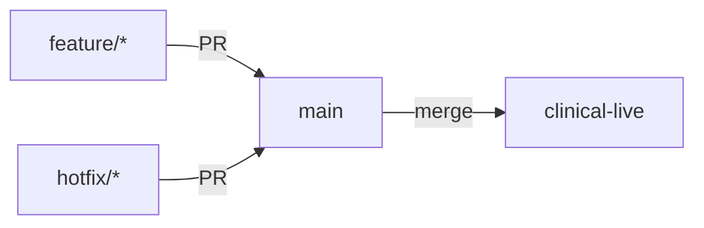

# GitHub

**Last updated:** 23 March 2026

This page documents the GitHub configuration, branch protection rules, CI pipelines, and operational learnings for the `bailey-medics` organisation.

## Organisation

| Setting            | Value                 |
| ------------------ | --------------------- |
| Organisation       | `bailey-medics`       |
| Plan               | GitHub Enterprise     |
| Primary repository | `quillmedical`        |
| Data repository    | `quill-question-bank` |

The Enterprise plan is required for **metadata restrictions** (branch naming enforcement via repository rulesets). The Team plan only supports branch naming rules in "evaluate" mode.

## Repositories

### quillmedical

The main application repository containing backend, frontend, infrastructure, and documentation.

### quill-question-bank

Stores teaching question bank content (YAML config files and images). Synced to the app via GCS bucket. Has its own branch protection and naming rulesets mirroring the main repo.

## Branch strategy



### Branch types

| Branch          | Purpose                           | Deploys to         |
| --------------- | --------------------------------- | ------------------ |
| `feature/*`     | New features and non-urgent fixes | CI checks only     |
| `hotfix/*`      | Urgent production fixes           | CI checks only     |
| `main`          | Integration branch                | Staging + Teaching |
| `clinical-live` | Production-ready code             | Production         |
| `release/**`    | Release candidates (future use)   | —                  |

### Rules

- All development happens on `feature/*` or `hotfix/*` branches
- `main` requires a pull request — never push directly
- Branch names must match `^(feature|hotfix)/.+` (enforced at creation time)
- Use `hotfix/*` only for urgent production fixes; `feature/*` for everything else

## Branch protection rulesets

Managed by Terraform in `infra/github/branch_rules.tf`. Four rulesets are defined across both repositories.

!!! warning "Manual apply required for GitHub rulesets"
The `infra/github/` Terraform uses a **local state backend**. Merging `.tf` changes to `main` does not automatically apply them. You must run `terraform apply` locally:

```bash
export GITHUB_TOKEN=$(gh auth token)
cd infra/github/
terraform plan -var-file=terraform.tfvars
terraform apply -var-file=terraform.tfvars
```

The GCP infrastructure Terraform (`infra/`) uses a remote backend and is applied automatically via the Terraform CI workflow.

### Ruleset 1 — Protected branches (quillmedical)

**Targets:** `main`, `clinical-live`, `release/**`

| Rule                          | Setting                                                |
| ----------------------------- | ------------------------------------------------------ |
| Pull request required         | Yes (0 approvals while solo; increase when team grows) |
| Dismiss stale reviews on push | Yes                                                    |
| Required status checks        | All 10 CI checks (strict — branch must be up-to-date)  |
| Force push                    | Blocked                                                |
| Branch deletion               | Blocked                                                |
| Bypass actors                 | None (applies to admins too)                           |

### Ruleset 2 — Branch naming (quillmedical)

**Targets:** All branches except `main`, `clinical-live`, `release/**`

Pattern: `^(feature|hotfix)/.+` — branches that don't match are rejected at creation time.

### Ruleset 3 — Protected branches (quill-question-bank)

**Targets:** `main`

Same PR and force-push rules as quillmedical, but no required status checks (no CI pipeline on the data repo).

### Ruleset 4 — Branch naming (quill-question-bank)

Same `^(feature|hotfix)/.+` pattern as quillmedical.

## Required status checks

All 10 checks must pass before a PR can merge to `main`. The strict policy also requires the branch to be up-to-date with `main`.

### Python checks

| Check name       | What it does                                                                                              |
| ---------------- | --------------------------------------------------------------------------------------------------------- |
| `Python styling` | Runs pre-commit hooks (ruff, black, mypy, bandit, cspell, trailing whitespace, YAML/TOML/JSON validation) |
| `Python unit`    | Runs `pytest` (excludes integration and e2e markers)                                                      |

### TypeScript checks

| Check name                              | What it does                                      |
| --------------------------------------- | ------------------------------------------------- |
| `typescript_checks (eslint)`            | ESLint on frontend source                         |
| `typescript_checks (prettier)`          | Prettier formatting check                         |
| `typescript_checks (stylelint)`         | CSS/SCSS linting                                  |
| `typescript_checks (typecheck:all)`     | TypeScript strict mode compilation                |
| `typescript_checks (unit-test:run)`     | Vitest unit tests                                 |
| `typescript_checks (storybook:build)`   | Storybook static build succeeds                   |
| `typescript_checks (storybook:test:ci)` | Storybook interaction tests (Playwright/Chromium) |

### Security checks

| Check name                | What it does                                      |
| ------------------------- | ------------------------------------------------- |
| `Semgrep (frontend SAST)` | Static analysis security testing on frontend code |

## CI/CD workflows

Four GitHub Actions workflows handle the full lifecycle. Each is self-contained — a change to one cannot affect the others.

### Branch CI (`branch-ci.yml`)

**Triggers:** Push to any branch except `main`, `clinical-live`, `release/**`, and `hotfix/**` (covers `feature/*`, `copilot/*`, `renovate/*`, `dependabot/*`, etc.)

**Jobs:**

1. **`python_checks`** — Matrix: `styling` and `unit` (Python 3.13)
2. **`typescript_checks`** — Matrix: 7 parallel tasks (eslint, prettier, stylelint, typecheck:all, unit-test:run, storybook:build, storybook:test:ci)
3. **`frontend_security`** — Semgrep SAST scan
4. **`open-pr`** — Auto-creates a PR to `main` for `feature/*` and `copilot/*` branches only (Renovate/Dependabot create their own PRs)

All failures send Slack notifications.

### Release and hotfix (`release-hotfix.yml`)

**Triggers:** Push to `release/**` and `hotfix/**`

Same checks as the feature workflow, plus a **docs build** job that runs after all checks pass. This builds both MkDocs (backend) and TypeDoc + Storybook (frontend) documentation to verify the docs still compile.

### Deploy staging and teaching (`deploy-staging-teaching.yml`)

**Triggers:** Push to `main`, manual dispatch

**Jobs:**

1. **`changes`** — Detects which services changed (backend/frontend) using path filters
2. **`build`** — Builds Docker images and pushes to both staging and teaching Artifact Registry
3. **`deploy-staging`** — Updates Cloud Run services in the staging GCP project
4. **`deploy-teaching`** — Updates Cloud Run services in the teaching GCP project
5. **`notify`** — Slack notification on success or failure

Smoke tests hit `/api/health` on each environment after deploy (5 retries, 10 second intervals).

### Deploy production (`deploy-production.yml`)

**Triggers:** Push to `clinical-live`, manual dispatch

Same structure as staging deploy but targets the production GCP project. Key differences:

- `concurrency.cancel-in-progress: false` — never cancels a running production deploy
- Ignores changes to `docs/**`, `*.md`, `safety/**`, `.github/prompts/**`
- Images tagged as `clinical-live-<sha>` and `latest`

### Terraform (`terraform.yml`)

**Triggers:** Push/PR to `main` or `clinical-live` when `infra/**` files change

- **PRs:** Runs `terraform plan` for staging, teaching, and production; posts plan output as a PR comment
- **main push:** Runs `terraform apply` for staging and teaching
- **clinical-live push:** Runs `terraform apply` for production

### Documentation (`docs.yml`)

**Triggers:** Push to `main` when backend, frontend, docs, shared, or prompt files change

Builds and deploys to GitHub Pages:

- MkDocs (backend documentation)
- TypeDoc (frontend API docs)
- Storybook (component catalogue)
- OpenAPI/Swagger (auto-generated from FastAPI)

## Pre-commit hooks

Local pre-commit hooks run on every commit (configured in `.pre-commit-config.yaml`). These match what CI runs in the `Python styling` check.

| Hook                    | Purpose                                                      |
| ----------------------- | ------------------------------------------------------------ |
| **ruff**                | Python linting (rules: E, F, W, I, UP, B) with auto-fix      |
| **black**               | Python formatting (line-length 79)                           |
| **trailing-whitespace** | Remove trailing whitespace                                   |
| **end-of-file-fixer**   | Ensure files end with a newline                              |
| **check-yaml**          | Validate YAML syntax                                         |
| **check-toml**          | Validate TOML syntax                                         |
| **check-json**          | Validate JSON syntax                                         |
| **cspell**              | Spelling checker (custom dictionary in `cspell.config.json`) |
| **mypy**                | Python static type checking (strict mode)                    |
| **bandit**              | Python security linting                                      |

Frontend lint-staged hooks also run via Husky but only when frontend files are staged.

## Slack notifications

All workflows send Slack notifications on failure via the `slackapi/slack-github-action` action using an incoming webhook (`SLACK_WEBHOOK_URL` secret). Deploy workflows also notify on success.

## Secrets

GitHub Actions secrets are configured per-environment. Never commit tokens or keys.

| Secret                         | Used by                                     |
| ------------------------------ | ------------------------------------------- |
| `GCP_STAGING_WIF_PROVIDER`     | Workload Identity Federation for staging    |
| `GCP_STAGING_SERVICE_ACCOUNT`  | Staging service account                     |
| `GCP_STAGING_PROJECT_ID`       | Staging GCP project ID                      |
| `GCP_TEACHING_WIF_PROVIDER`    | Workload Identity Federation for teaching   |
| `GCP_TEACHING_SERVICE_ACCOUNT` | Teaching service account                    |
| `GCP_TEACHING_PROJECT_ID`      | Teaching GCP project ID                     |
| `GCP_PROD_WIF_PROVIDER`        | Workload Identity Federation for production |
| `GCP_PROD_SERVICE_ACCOUNT`     | Production service account                  |
| `GCP_PROD_PROJECT_ID`          | Production GCP project ID                   |
| `SLACK_WEBHOOK_URL`            | Slack notifications                         |

Authentication to GCP uses **Workload Identity Federation** — no long-lived service account keys.

## Learnings

### GitHub Enterprise is required for branch naming enforcement

The Team plan supports repository rulesets but only evaluates metadata restrictions (branch naming patterns) in "evaluate" mode — violations are logged but not blocked. Upgrading to Enterprise enables "active" enforcement, which rejects non-conforming branch names at creation time.

### Terraform rulesets use local state for GitHub

The `infra/github/` Terraform manages GitHub rulesets (branch protection, naming conventions) but uses a local state file. Unlike the GCP Terraform (which has a remote backend and CI-driven apply), GitHub ruleset changes must be applied manually after merging. A GitHub Actions workflow notification warns when this is needed.

### All 10 status checks should be required

Initially only 5 "lean" checks were configured (Python styling, Python unit, eslint, typecheck, unit tests). This was expanded to all 10 checks including prettier, stylelint, storybook build, storybook tests, and Semgrep because in a healthcare application, bad UX can lead to patient harm — every check catches a different class of issue.

### Auto-PR creation on feature and Copilot push

The branch CI workflow automatically creates a PR to `main` when pushing to a `feature/*` or `copilot/*` branch. The latest commit message is used as the PR title. This reduces friction and ensures every feature branch has a visible PR for review. Renovate and Dependabot branches also get CI checks but create their own PRs.

### DCB 0129 clinical safety compliance

The branch protection rules form part of the auditable change-control process required by DCB 0129. They ensure:

- All changes go through pull-request review, creating an approval record
- The naming convention keeps the commit graph traceable for hazard-log and incident-response audits
- Force pushes are blocked on protected branches to preserve history
- No bypass actors are configured, so rules apply to everyone including admins
