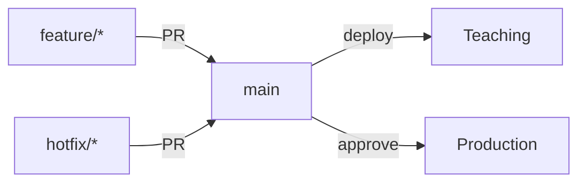

# GitHub

**Last updated:** 25 May 2026

This page documents the GitHub configuration, branch protection rules, and operational learnings for the `bailey-medics` organisation.

## Organisation

| Setting            | Value                 |
| ------------------ | --------------------- |
| Organisation       | `bailey-medics`       |
| Plan               | GitHub Enterprise     |
| Primary repository | `quillmedical`        |
| Data repository    | `quill-question-bank` |

The Enterprise plan is required for **metadata restrictions** (branch naming enforcement via repository rulesets). The Team plan only supports branch naming rules in "evaluate" mode.

## Repositories

### quillmedical

The main application repository containing backend, frontend, infrastructure, and documentation.

### quill-question-bank

Stores teaching question bank content (YAML config files and images). Synced to the app via GCS bucket. Has its own branch protection and naming rulesets mirroring the main repo.

## Branch strategy



### Branch types

| Branch       | Purpose                           | Deploys to                             |
| ------------ | --------------------------------- | -------------------------------------- |
| `feature/*`  | New features and non-urgent fixes | CI checks only                         |
| `hotfix/*`   | Urgent fixes                      | CI checks only                         |
| `copilot/*`  | AI-generated branches             | CI checks only                         |
| `renovate/*` | Automated dependency updates      | CI checks only                         |
| `main`       | Trunk — single protected branch   | Teaching (auto), Production (approved) |

### Rules

- All development happens on `feature/*`, `hotfix/*`, or `copilot/*` branches
- `main` requires a pull request — never push directly
- Branch names must match `^(feature|hotfix|copilot|renovate)/.+` (enforced at creation time)
- Use `hotfix/*` only for urgent production fixes; `feature/*` for everything else

## Branch protection rulesets

Managed by Terraform in `infra/github/branch_rules.tf`. Four rulesets are defined across both repositories.

!!! warning "Manual apply required for GitHub rulesets"
The `infra/github/` Terraform uses a **local state backend**. Merging `.tf` changes to `main` does not automatically apply them. You must run `terraform apply` locally:

    ```bash
    export GITHUB_TOKEN=$(gh auth token)
    cd infra/github/
    terraform plan -var-file=terraform.tfvars
    terraform apply -var-file=terraform.tfvars
    ```

    The GCP infrastructure Terraform (`infra/`) uses a remote backend and is applied automatically via the Terraform CI workflow.

### Ruleset 1 — Protected branches (quillmedical)

**Targets:** `main`

| Rule                          | Setting                                                |
| ----------------------------- | ------------------------------------------------------ |
| Pull request required         | Yes (0 approvals while solo; increase when team grows) |
| Dismiss stale reviews on push | Yes                                                    |
| Required status checks        | All 11 CI checks (strict — branch must be up-to-date)  |
| Force push                    | Blocked                                                |
| Branch deletion               | Blocked                                                |
| Bypass actors                 | None (applies to admins too)                           |

### Ruleset 2 — Branch naming (quillmedical)

**Targets:** All branches except `main`

Pattern: `^(feature|hotfix|copilot|renovate)/.+` — branches that don't match are rejected at creation time.

### Ruleset 3 — Protected branches (quill-question-bank)

**Targets:** `main`

Same PR and force-push rules as quillmedical, but no required status checks (no CI pipeline on the data repo).

### Ruleset 4 — Branch naming (quill-question-bank)

Same `^(feature|hotfix|copilot|renovate)/.+` pattern as quillmedical.

## Required status checks

All 11 checks must pass before a PR can merge to `main`. The strict policy also requires the branch to be up-to-date with `main`.

### Fast tier (every push)

| Check name                            | What it does                                                         |
| ------------------------------------- | -------------------------------------------------------------------- |
| `Python styling`                      | Pre-commit hooks (ruff, black, mypy, bandit, cspell, YAML/TOML/JSON) |
| `Python unit`                         | pytest (excludes integration and e2e markers)                        |
| `typescript_checks (eslint)`          | ESLint on frontend source                                            |
| `typescript_checks (prettier)`        | Prettier formatting check                                            |
| `typescript_checks (stylelint)`       | CSS/SCSS linting                                                     |
| `typescript_checks (typecheck:all)`   | TypeScript strict mode compilation                                   |
| `typescript_checks (unit-test:run)`   | Vitest unit tests                                                    |
| `typescript_checks (storybook:build)` | Storybook static build succeeds                                      |

### Heavy tier (ready PRs only)

| Check name                              | What it does                                      |
| --------------------------------------- | ------------------------------------------------- |
| `typescript_checks (storybook:test:ci)` | Storybook interaction tests (Playwright/Chromium) |
| `Semgrep (frontend SAST)`               | Static application security testing               |
| `E2E (Playwright)`                      | Full-stack end-to-end tests                       |

## Pre-commit hooks

Local pre-commit hooks run on every commit (configured in `.pre-commit-config.yaml`). These match what CI runs in the `Python styling` check.

| Hook                    | Purpose                                                      |
| ----------------------- | ------------------------------------------------------------ |
| **ruff**                | Python linting (rules: E, F, W, I, UP, B) with auto-fix      |
| **black**               | Python formatting (line-length 79)                           |
| **trailing-whitespace** | Remove trailing whitespace                                   |
| **end-of-file-fixer**   | Ensure files end with a newline                              |
| **check-yaml**          | Validate YAML syntax                                         |
| **check-toml**          | Validate TOML syntax                                         |
| **check-json**          | Validate JSON syntax                                         |
| **cspell**              | Spelling checker (custom dictionary in `cspell.config.json`) |
| **mypy**                | Python static type checking (strict mode)                    |
| **bandit**              | Python security linting                                      |

Frontend lint-staged hooks also run via Husky but only when frontend files are staged.

## Secrets

GitHub Actions secrets are configured per-environment. Never commit tokens or keys.

| Secret                         | Used by                                       |
| ------------------------------ | --------------------------------------------- |
| `GCP_TEACHING_WIF_PROVIDER`    | Workload Identity Federation for teaching     |
| `GCP_TEACHING_SERVICE_ACCOUNT` | Teaching service account                      |
| `GCP_TEACHING_PROJECT_ID`      | Teaching GCP project ID                       |
| `GCP_PROD_WIF_PROVIDER`        | WIF for production _(not yet active)_         |
| `GCP_PROD_SERVICE_ACCOUNT`     | Production service account _(not yet active)_ |
| `GCP_PROD_PROJECT_ID`          | Production GCP project ID _(not yet active)_  |

Authentication to GCP uses **Workload Identity Federation** — no long-lived service account keys.

## Learnings

### GitHub Enterprise is required for branch naming enforcement

The Team plan supports repository rulesets but only evaluates metadata restrictions (branch naming patterns) in "evaluate" mode — violations are logged but not blocked. Upgrading to Enterprise enables "active" enforcement, which rejects non-conforming branch names at creation time.

### Terraform rulesets use local state for GitHub

The `infra/github/` Terraform manages GitHub rulesets (branch protection, naming conventions) but uses a local state file. Unlike the GCP Terraform (which has a remote backend and CI-driven apply), GitHub ruleset changes must be applied manually after merging.

### All 11 status checks should be required

Initially only 5 "lean" checks were configured (Python styling, Python unit, eslint, typecheck, unit tests). This was expanded to all 11 checks including prettier, stylelint, storybook build, storybook tests, Semgrep, and E2E because in a healthcare application, bad UX can lead to patient harm — every check catches a different class of issue.

### Auto-PR creation on feature and Copilot push

The branch CI workflow automatically creates a draft PR to `main` when pushing to a `feature/*` or `copilot/*` branch. The latest commit message is used as the PR title. This reduces friction and ensures every feature branch has a visible PR for review.

### DCB 0129 clinical safety compliance

The branch protection rules form part of the auditable change-control process required by DCB 0129. They ensure:

- All changes go through pull-request review, creating an approval record
- The naming convention keeps the commit graph traceable for hazard-log and incident-response audits
- Force pushes are blocked on protected branches to preserve history
- No bypass actors are configured, so rules apply to everyone including admins
