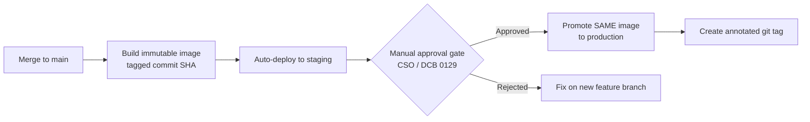
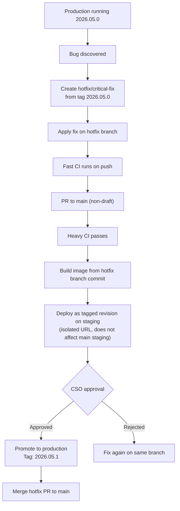

# CI/CD and branching overhaul plan

## Status

**Draft** — awaiting implementation.

## Motivation

The current GitFlow-style branching model (`main` → `release/*` → `clinical-live`) introduces drift risk between long-lived branches. In a clinical codebase subject to DCB 0129, drift is a hazard: a fix on `clinical-live` can diverge from `main`, invalidating the assumption that validated code is what runs in production.

This plan replaces GitFlow with trunk-based development and a build-once-promote deployment model.

---

## Current state (baseline)

| Concern                               | Today                                                                                               |
| ------------------------------------- | --------------------------------------------------------------------------------------------------- |
| Permanent branches                    | `main`, `clinical-live`                                                                             |
| Deployment trigger (staging/teaching) | Push to `main`                                                                                      |
| Deployment trigger (production)       | Push to `clinical-live`                                                                             |
| Image builds                          | Separate builds per environment (teaching tags `main-<sha>`, production tags `clinical-live-<sha>`) |
| Branch CI                             | `branch-ci.yml` — runs on all pushes except `main`, `clinical-live`, `release/**`, `hotfix/**`      |
| Release CI                            | `release-hotfix.yml` — identical checks for `release/**` and `hotfix/**`                            |
| Hotfix flow                           | `hotfix/*` → PR to `clinical-live` → auto back-merge PR to `main`                                   |
| Branch protection                     | Terraform rulesets in `infra/github/branch_rules.tf`                                                |
| Test tiers                            | Everything runs on every push (no fast/heavy split)                                                 |
| Tagging                               | None automated                                                                                      |
| CSO sign-off                          | Manual, not formalised in CI                                                                        |

### Workflows to retire

| File                                   | Reason                                                   |
| -------------------------------------- | -------------------------------------------------------- |
| `release-hotfix.yml`                   | No more `release/*` or long-lived `hotfix/*` branches    |
| `hotfix-backmerge.yml`                 | No `clinical-live` to back-merge from                    |
| `deploy-production.yml` (current form) | Production deploy will become a promotion, not a rebuild |

---

## Target state

### Branching model

- **Single permanent branch**: `main`.
- **Short-lived feature branches**: `feature/*`, `copilot/*`, `hotfix/*` (for urgent fixes, still targeting `main`).
- **No `clinical-live`** — delete after migration.
- **No `release/*`** — releases are promotions, not branches.

### Branch naming (Terraform ruleset update)

```
^(feature|hotfix|copilot|renovate)/.+
```

No change to the regex. Remove `clinical-live` and `release/**` from protected-branch includes.

### Deployment: build once, promote



- **Image tag**: `<sha>` (e.g. `europe-west2-docker.pkg.dev/<project>/quill/backend:<sha>`)
- **Staging deploy**: automatic on merge to `main`
- **Production deploy**: promotion of the staging-validated image via GitHub Environment approval gate (`environment: production` with required reviewers)
- **Never rebuild** for production — same bytes, different Cloud Run revision

### Production hotfixes

**The problem**: production is running commit `abc123` (promoted and tagged `2026.05.0`). Since then, `main` has moved forward with features `def456`, `ghi789`, etc. A critical bug is found in production. You can't promote the current `main` tip because it contains unvalidated feature work.

**Solution: short-lived hotfix branch from the production tag.**



**Rules:**

1. **Branch from the production tag**, not from `main`. This guarantees the fix is applied to exactly what's running in production — no unvalidated features included.
2. **The hotfix branch is short-lived** (hours, not days). It exists only until the fix is deployed and merged.
3. **CI runs normally** — fast tier on push, heavy tier when the PR is marked ready.
4. **Build a dedicated image** from the hotfix commit. This is a separate image from the `main`-line builds, but follows the same immutable SHA-tagged pattern.
5. **Smoke-test via Cloud Run tagged revision** (see isolation section below).
6. **Merge the PR to `main`** after production promotion. This ensures the fix is not lost when the next `main` promotion happens.
7. **Tag with the next CalVer patch**: `2026.05.1`, `2026.05.2`, etc.

#### Hotfix staging isolation

**Problem**: staging auto-deploys on every merge to `main`. If another developer merges a feature while you're smoke-testing a hotfix, their code overwrites your staging deployment.

**Solution: Cloud Run tagged revisions.**

Cloud Run allows deploying a revision with a **traffic tag** that gets its own URL without receiving any live traffic:

```bash
gcloud run deploy quill-backend-staging \
  --image=<registry>/quill/backend:<hotfix-sha> \
  --no-traffic \
  --tag=hotfix
```

This creates an isolated URL like:

```
https://hotfix---quill-backend-staging-xxxxx.run.app
```

Meanwhile, `https://quill-backend-staging-xxxxx.run.app` (the main staging URL) continues serving the latest auto-deployed `main` code. Other developers' merges don't touch the hotfix revision.

**Properties:**

- Zero cost when idle (Cloud Run scales to zero)
- No extra infrastructure to maintain
- The tagged revision URL is deterministic and can be used in automated smoke tests
- Removed after promotion (`gcloud run services update-traffic ... --remove-tags=hotfix`)

**Alternative considered**: a dedicated "pre-production" environment. Rejected — it duplicates infrastructure (database, FHIR, EHRbase) for a scenario that happens rarely. Tagged revisions give isolation for free.

#### Database schema divergence

**Problem**: the tagged revision shares the same database/FHIR/EHRbase as staging. If `main` has applied schema migrations since the last production promotion, the hotfix code (based on the production-era schema) may be incompatible with the newer staging database.

**Example**: production is on migration `0042`. Since then, `main` merged a feature that added migration `0043` (renames column `patient_name` → `display_name`). The hotfix code still references `patient_name` — it'll break against the staging DB that has already applied `0043`.

**Solution: enforce expand-contract (additive-only) migrations.**

This is the standard rule for trunk-based development and zero-downtime deployments:

| Phase        | What happens                                                                 | Commit                                                      |
| ------------ | ---------------------------------------------------------------------------- | ----------------------------------------------------------- |
| **Expand**   | Add the new column (`display_name`), copy data, update code to write to both | Feature merge A                                             |
| **Contract** | Drop the old column (`patient_name`) once no running revision uses it        | Separate feature merge B, after A is promoted to production |

**Rules:**

1. **Never rename or drop a column in a single migration.** Always expand first (add new, keep old), promote to production, then contract (remove old) in a later migration.
2. **Never alter a column type destructively** (e.g. `varchar` → `int`). Add a new column, migrate data, update code, promote, then drop.
3. **New tables and new columns are always safe** — old code simply ignores them.
4. **The contract step can only merge to `main` after the expand step has reached production.** This is the key discipline.

With this pattern, code from any recent commit (including a hotfix branched from an older production tag) always works against the latest schema, because the schema only ever adds — it never removes something that old code still needs.

**What if a migration already broke this rule?**

If staging has a destructive migration that makes the hotfix incompatible:

1. **Preferred**: fix-forward instead (merge the hotfix to `main`, which already has the new schema, and promote the tip). This sidesteps the incompatibility.
2. **If fix-forward isn't safe**: deploy the hotfix directly to production using a Cloud Run traffic-split canary (e.g. 1% traffic to the hotfix revision, 99% to existing). Monitor, then shift to 100%. This bypasses staging entirely but is justified for urgent clinical fixes.
3. **Last resort**: spin up an ephemeral database from a production snapshot, apply only the hotfix migration, and smoke-test against that. Complex but provides full isolation.

**Alembic enforcement:**

Add a CI check (fast tier) that rejects migrations containing `DROP COLUMN`, `ALTER COLUMN ... TYPE`, or `RENAME COLUMN` unless explicitly annotated as a contract step with a comment referencing the production tag where the expand was promoted:

```python
# alembic contract step — expand promoted in 2026.05.0
# Safe to drop: patient_name
op.drop_column("patients", "patient_name")
```

This makes the expand-contract discipline auditable and machine-enforced.

**Copilot instructions update:**

Create `.github/instructions/backend.instructions.md` with `applyTo: backend/**` (matching the existing pattern for `components.instructions.md` and `pages.instructions.md`):

- When generating Alembic migrations that drop, rename, or alter column types: always include the contract annotation comment (`# alembic contract step — expand promoted in <tag>`) and verify the referenced tag exists.
- **STOP and ask the human before proceeding** when generating any expand migration (adding new columns alongside old ones). Explain clearly: "This is an expand-contract migration. The old column must NOT be removed until this code reaches production. Do you want me to proceed?" Every time — no exceptions, no assumptions.
- Never generate a single migration that both adds a replacement and drops the original in one step.

#### Fix-forward shortcut

**Why not just merge the fix to `main` and promote the new tip?**

- Only safe if `main` hasn't accumulated unvalidated features since the last promotion.
- In a solo/small-team context, this may often be fine — if the new features on `main` have already passed heavy CI, you can choose to promote the whole tip.
- **Decision point**: if the delta between production tag and `main` tip is small and all tests pass, prefer fix-forward (simpler). If the delta is large or contains incomplete work, use the hotfix branch.

#### Workflow trigger for hotfix builds

The existing `deploy.yml` triggers on push to `main`. Hotfix images need a separate build path:

```yaml
# In deploy.yml or a dedicated hotfix-deploy.yml
on:
  workflow_dispatch:
    inputs:
      ref:
        description: "Git ref to build and deploy (e.g. hotfix/critical-fix branch or tag)"
        required: true
      deploy_tag:
        description: "Cloud Run traffic tag for isolated smoke testing (e.g. 'hotfix')"
        required: false
        default: "hotfix"
```

This allows manually triggering a build+deploy from the hotfix branch. The `workflow_dispatch` trigger provides an auditable record of who initiated the emergency deploy. The `deploy_tag` input controls the Cloud Run revision tag for isolated access.

**DCB 0129 compliance**: The annotated tag on the hotfix promotion records the same metadata (who approved, safety-review reference) as a normal promotion. The hotfix branch name and merged PR create the audit trail.

### Tagging strategy

| When                  | What                  | Format                                     |
| --------------------- | --------------------- | ------------------------------------------ |
| Every merge to `main` | Image tagged with SHA | `abc1234` (automatic)                      |
| Production promotion  | Annotated git tag     | CalVer: `2026.05.0`, `2026.05.1`, ...      |
| Hotfix promotion      | Annotated git tag     | CalVer patch: `2026.05.1` (next increment) |

Annotated tag message template:

```
Approved-by: <github-username>
Approved-at: <ISO-8601 timestamp>
Safety-review: <hazard-log reference or "routine">
```

---

## Test tiering

### Fast tier (every push, every branch)

Runs on: `push` to any non-`main` branch.

| Category             | Check                                        | Current location                 |
| -------------------- | -------------------------------------------- | -------------------------------- |
| Python styling       | `pre-commit run --all-files`                 | `branch-ci.yml` matrix `styling` |
| Python unit          | `pytest -q -m "not integration and not e2e"` | `branch-ci.yml` matrix `unit`    |
| ESLint               | `yarn eslint`                                | `branch-ci.yml` matrix           |
| Prettier             | `yarn prettier`                              | `branch-ci.yml` matrix           |
| Stylelint            | `yarn stylelint`                             | `branch-ci.yml` matrix           |
| TypeScript typecheck | `yarn typecheck:all`                         | `branch-ci.yml` matrix           |
| Frontend unit tests  | `yarn unit-test:run`                         | `branch-ci.yml` matrix           |
| Storybook build      | `yarn storybook:build`                       | `branch-ci.yml` matrix           |

### Heavy tier (ready-for-review PRs only)

Runs on: `pull_request` types `[ready_for_review, synchronize]`, gated by `if: github.event.pull_request.draft == false`.

| Category                    | Check                                   | Notes                                 |
| --------------------------- | --------------------------------------- | ------------------------------------- |
| Storybook interaction tests | `yarn storybook:test:ci`                | Installs Chromium; currently ~3–5 min |
| Semgrep (SAST)              | `semgrep --config .semgrep.yml --error` | Currently in fast; move to heavy      |
| E2E (Playwright)            | `yarn e2e`                              | Requires full stack (see below)       |
| MkDocs build                | `mkdocs build --strict`                 | Python + Node + Yarn (see below)      |

### Scheduled (not in merge path)

| Check                         | Schedule                  | Workflow               |
| ----------------------------- | ------------------------- | ---------------------- |
| OWASP ZAP baseline            | Weekly (Monday 04:00 UTC) | `zap-scan.yml`         |
| Security pentest (Hypothesis) | Monthly (1st, 03:00 UTC)  | `security-pentest.yml` |

### pytest markers (register in `pyproject.toml`)

```toml
[tool.pytest.ini_options]
markers = [
    "integration: marks tests as integration tests (deselect with '-m \"not integration\"')",
    "e2e: marks end-to-end tests requiring full stack",
    "pentest: marks security penetration tests (run with '-m pentest')",
    "slow: marks tests that should only run in the heavy tier",
]
```

Currently registered: `integration`, `pentest`. Add: `e2e`, `slow`.

---

## Draft-PR mechanism (fast/heavy switch)

### Workflow triggers

Both tiers live in the same `branch-ci.yml` file. Two triggers, jobs pinned to one event each via `github.event_name`:

```yaml
on:
  push:
    branches-ignore:
      - main
  pull_request:
    types: [ready_for_review, synchronize]
    branches: [main]

jobs:
  # Fast — only fires on push events
  python_checks:
    if: github.event_name == 'push'
    ...

  typescript_checks:
    if: github.event_name == 'push'
    ...

  open-pr:
    if: github.event_name == 'push' && (startsWith(...))
    ...

  # Heavy — only fires on non-draft PR events
  heavy_checks:
    if: github.event_name == 'pull_request' && github.event.pull_request.draft == false
    ...
```

### Developer flow

1. Push to `feature/foo` → fast CI runs + `open-pr` creates a **draft** PR.
2. Iterate (each push re-runs fast only).
3. Click **Ready for review** → heavy tier fires.
4. Further pushes while ready → both fast (via `push`) and heavy (via `synchronize`) run.
5. All checks green → merge.
6. Expect 2 workflow runs per push on an open non-draft PR — one per event. This is normal.

### `open-pr` job update

Change the current `open-pr` job to create PRs as **draft**:

```yaml
gh pr create \
--base main \
--head "$GITHUB_REF_NAME" \
--title "$TITLE" \
--body "Auto-created PR for \`$GITHUB_REF_NAME\`." \
--label "$LABEL" \
--draft
```

Note: A PR opened by `GITHUB_TOKEN` does NOT trigger `pull_request: opened` (GitHub recursion guard). This is fine — heavy isn't wanted on a fresh draft; `ready_for_review` is a human action and fires normally.

---

## Clinical safety principle

In a clinical application, **all code is clinical code**. A CSS colour change can make an allergy warning invisible. A font-size tweak can hide a drug interaction. A layout change can push a critical field off-screen. There is no safe boundary between "clinical" and "non-clinical" files — the entire application surface is a potential hazard vector.

This means:

- There is no separate "clinical test" category. Every test in the suite is a clinical safety verification.
- The **entire CI pipeline** (fast + heavy) is the safety gate. All checks are non-bypassable before merge.
- No path-filtering for safety — every PR runs the full suite regardless of which files changed.

The merge gate (all required status checks passing) IS the DCB 0129 change-control checkpoint for code quality. The CSO approval gate at production promotion is the human sign-off checkpoint.

---

## Branch protection (Terraform changes)

### Remove

- `clinical_live_protection` ruleset (entire resource)
- `release/**` from `protected_branches` conditions
- `clinical-live` from `branch_naming` exclusions

### Update `protected_branches`

Target: `refs/heads/main` only.

Required checks (updated):

| Check                                 | Tier                                 |
| ------------------------------------- | ------------------------------------ |
| `Python styling`                      | Fast                                 |
| `Python unit`                         | Fast                                 |
| `typescript_checks (eslint)`          | Fast                                 |
| `typescript_checks (prettier)`        | Fast                                 |
| `typescript_checks (stylelint)`       | Fast                                 |
| `typescript_checks (typecheck:all)`   | Fast                                 |
| `typescript_checks (unit-test:run)`   | Fast                                 |
| `typescript_checks (storybook:build)` | Fast                                 |
| `Heavy checks`                        | Heavy (job name from `pr-heavy.yml`) |

No gatekeeper job needed: heavy is only ever skipped while a PR is draft, and a draft PR cannot be merged.

---

## Storybook

| Task                | Tier  | Reason                                                         |
| ------------------- | ----- | -------------------------------------------------------------- |
| `storybook:build`   | Fast  | Build is quick (~30s); validates component compilation         |
| `storybook:test:ci` | Heavy | Spawns Storybook server + Chromium interaction tests; ~3–5 min |

`storybook:test:ci` self-builds — the script is:

```bash
concurrently -k -s first \
  "yarn storybook --no-open --quiet --ci" \
  "wait-on tcp:127.0.0.1:6006 -t 120000 && yarn storybook:test"
```

It starts a dev server (which builds) then runs interaction tests. No explicit prior `storybook:build` step needed.

---

## Documentation (MkDocs)

### Current setup

- MkDocs config: `docs/mkdocs.yml`
- Python deps: via Poetry (`backend/pyproject.toml` dev group — includes `mkdocstrings` with `griffe` handler)
- Node/Yarn: needed for `yarn docs:build` (TypeDoc) and `yarn storybook:build` (Storybook static site embedded in docs)
- Docs workflow: `docs.yml` — triggers on push to `main` with path filters

### Tier: heavy

MkDocs build is slow because it:

1. Installs backend Python deps (Poetry)
2. Exports OpenAPI JSON (`scripts/dump_openapi.py`)
3. Installs frontend deps (Yarn)
4. Builds Storybook static (`yarn storybook:build`)
5. Builds TypeDoc (`yarn docs:build`)
6. Runs `mkdocs build` with `mkdocstrings` (parses Python source via `griffe`)

### Branch CI: validate on heavy

Add `mkdocs build --strict` to the heavy tier for PRs. This catches:

- Broken internal links
- Missing nav entries
- Orphaned pages
- `mkdocstrings` failures (invalid Python references)

### Deploy: post-merge only

Keep docs **publish/deploy** in `docs.yml`, triggered on push to `main`. Do not publish from branch CI.

### Cache optimisation (future)

Cache generated API docs keyed on `hashFiles('backend/**/*.py', 'frontend/src/**/*')`. Prose-only edits become cache hits.

---

## E2E testing

### Current state

- Config: `frontend/playwright.config.ts`
- `baseURL: "http://localhost"` — expects the full stack behind Caddy reverse proxy
- Auth setup: logs in as `educator` user via the UI
- Tests: `e2e/tests/login.spec.ts` (single test so far)

### What E2E needs to run

The full stack: FastAPI backend + PostgreSQL + HAPI FHIR + EHRbase + Caddy + frontend. This means:

- **CI approach**: `docker compose -f compose.dev.yml up` (or a slimmed CI compose) as service containers, then run Playwright against `http://localhost`
- **Heavy tier only** — too slow and complex for fast feedback

### Future: merge queue

When E2E matures (more tests, stable), move the heavy suite into a **GitHub merge queue**. This runs on the speculative merge commit, closing the "two PRs each pass individually then conflict on main" gap. Required-check setup carries over unchanged.

---

## Deployment workflow (new)

### `deploy.yml` (replaces `deploy-staging-teaching.yml` and `deploy-production.yml`)

```yaml
name: Deploy

on:
  push:
    branches: [main]
    paths-ignore:
      - "docs/**"
      - "*.md"
      - "safety/**"
      - ".github/prompts/**"
  workflow_dispatch:
    inputs:
      ref:
        description: "Git ref to build and deploy (for hotfixes from a tag/branch)"
        required: false
        default: ""

jobs:
  build:
    name: Build ${{ matrix.service }}
    # Build ONCE, push with SHA tag
    # Tags: <registry>/quill/<service>:<sha>
    # Uses inputs.ref if provided (hotfix), otherwise github.sha
    ...

  deploy-staging:
    name: Deploy to staging
    needs: build
    environment: staging
    # Auto-deploy, no approval gate
    # Smoke test before production gate opens
    ...

  deploy-production:
    name: Deploy to production
    needs: deploy-staging
    environment: production  # Configured with required reviewers (CSO)
    # Promotes the SAME image — no rebuild
    # After deploy: create annotated CalVer tag
    ...
```

Key differences from today:

1. Single image tagged `<sha>`, not `main-<sha>` or `clinical-live-<sha>`
2. Production uses the same image as staging (zero rebuild)
3. Production gated by GitHub Environment approval (CSO sign-off)
4. Annotated tag created only at production promotion
5. `workflow_dispatch` with `ref` input enables hotfix deploys from non-`main` commits

---

## Slack notifications

Slack notifications are restricted to **main-branch CI/CD actions only** — never for feature-branch CI.

| Event                          | Notify? | Channel        |
| ------------------------------ | ------- | -------------- |
| Feature branch fast/heavy CI   | No      | —              |
| Deploy to staging (success)    | Yes     | `#deployments` |
| Deploy to staging (failure)    | Yes     | `#deployments` |
| Deploy to production (success) | Yes     | `#deployments` |
| Deploy to production (failure) | Yes     | `#deployments` |
| Main CI failure                | Yes     | `#ci-alerts`   |

**Rationale**: feature-branch failures are visible in the PR checks tab and don't need to interrupt the team. Main-branch failures and deployments are shared-state events that everyone should be aware of.

**Implementation**: remove all `slack-notify` steps from `branch-ci.yml`. Add notification steps to `deploy.yml` jobs using `if: always()` (to fire on both success and failure) with `${{ job.status }}` in the message payload.

---

## Migration plan

### Phase 1: test tiering (low risk, no branch changes)

- [x] Split `branch-ci.yml`: move `storybook:test:ci` and Semgrep into heavy jobs gated on `draft == false`.
- [x] Add `pull_request` trigger to `branch-ci.yml` (types: `ready_for_review`, `synchronize`).
- [x] Pin fast jobs with `if: github.event_name == 'push'`, heavy jobs with `if: github.event_name == 'pull_request'`.
- [x] Update `open-pr` job to create draft PRs.
- [x] Register new pytest markers (`e2e`, `slow`) in `pyproject.toml`.
- [x] Validate: push to a feature branch → only fast runs. Mark ready → heavy runs.

### Phase 2: build-once-promote (medium risk)

- [x] Refactor deploy workflows into a single `deploy.yml`.
- [x] Build images tagged with commit SHA only.
- [x] Remove Slack notifications from `branch-ci.yml` (moved to `deploy.yml` per notification policy).
- [ ] Configure GitHub Environment `production` with required reviewers (manual — see below).
- [x] Add annotated tag creation step after production deploy.
- [x] Delete `deploy-staging-teaching.yml` and `deploy-production.yml` (after validation).
- [ ] Validate: merge to `main` → teaching auto-deploys → approve → production deploys same image.

#### Production environment status

**Production (clinical) is currently not running on GCP** — spun down to save costs. The `promote-to-production` job in `deploy.yml` is ready but will not run until the environment is brought back online. When production is re-enabled:

1. Go to **Settings → Environments → production**.
2. Add required reviewers (CSO + at least one other).
3. Ensure the `GCP_PROD_WIF_PROVIDER` and `GCP_PROD_SERVICE_ACCOUNT` secrets are scoped to this environment.
4. Ensure the production service account has Artifact Registry Reader on the teaching project (for `gcrane copy` to pull source images).
5. Remove the `if: false` guard from the `promote-to-production` job.

#### Image promotion flow

```
teaching AR (build target)         production AR (promotion target)
  quill/backend:<sha>       ──gcrane copy──▶  quill/backend:<sha>
  quill/frontend:<sha>      ──gcrane copy──▶  quill/frontend:<sha>
```

The `gcrane copy` step in `deploy.yml` copies exact image bytes — no rebuild.

### Phase 3: retire `clinical-live` (irreversible)

- [x] Ensure `main` tip matches `clinical-live` tip (no drift).
- [x] Update Terraform rulesets: remove `clinical-live` protection, remove `release/**`.
- [ ] Delete `clinical-live` branch (manual — after PR merges).
- [x] Remove `release-hotfix.yml`, `hotfix-backmerge.yml`.
- [x] Update `deploy-production.yml` references / delete.
- [x] Update `copilot-instructions.md` and repo documentation.

### Phase 4: E2E in CI (parallel work)

- [ ] Create a CI-specific Docker Compose file (lighter than dev).
- [ ] Add E2E job to `pr-heavy.yml` with service container setup.
- [ ] Expand E2E test coverage beyond `login.spec.ts`.
- [ ] When stable: enable GitHub merge queue.

---

## Open questions — resolved

| Question                                | Answer                                                                                                                                                                                                |
| --------------------------------------- | ----------------------------------------------------------------------------------------------------------------------------------------------------------------------------------------------------- |
| Where do MkDocs deps live?              | `backend/pyproject.toml` dev group (Poetry). `mkdocstrings` with `griffe` handler is a Python dep installed via `poetry install --with dev`.                                                          |
| Does MkDocs build need Node + Yarn?     | **Yes.** The docs workflow installs Node 24 + Yarn 4 for `yarn storybook:build` and `yarn docs:build` (TypeDoc).                                                                                      |
| Does `storybook:test:ci` self-build?    | **Yes.** It runs `concurrently` with a live Storybook dev server. No prior `storybook:build` needed.                                                                                                  |
| What does E2E run against?              | **Full stack.** `baseURL: "http://localhost"` expects Caddy routing to backend + frontend. Auth setup logs in via the UI.                                                                             |
| Semgrep: keep in heavy or move to fast? | **Move to heavy.** It's fast (~30s) but introduces an external tool install (`pipx install semgrep`) that can flake. Keep fast tier pure code checks only. Revisit if it proves consistently sub-10s. |
| Clinical-tier path globs?               | See [clinical-safety tests section](#clinical-safety-tests) — covers FHIR/EHRbase clients, CBAC, auth, permissions, clinical schemas, patient domain.                                                 |
| Is `main` the only PR target?           | **Yes, after migration.** Today `clinical-live` is also a target (for `release/*` and `hotfix/*`). Post-migration, only `main` exists.                                                                |

---

## Files to create/modify

| File                                            | Action                                                                                                             |
| ----------------------------------------------- | ------------------------------------------------------------------------------------------------------------------ |
| `.github/workflows/branch-ci.yml`               | Add `pull_request` trigger + heavy jobs; move `storybook:test:ci` and Semgrep to heavy; add `--draft` to `open-pr` |
| `.github/workflows/deploy.yml`                  | **New** — unified build-once-promote                                                                               |
| `.github/workflows/deploy-staging-teaching.yml` | Delete (replaced by `deploy.yml`)                                                                                  |
| `.github/workflows/deploy-production.yml`       | Delete (replaced by `deploy.yml`)                                                                                  |
| `.github/workflows/release-hotfix.yml`          | Delete                                                                                                             |
| `.github/workflows/hotfix-backmerge.yml`        | Delete                                                                                                             |
| `infra/github/branch_rules.tf`                  | Remove `clinical_live_protection`, update required checks                                                          |
| `backend/pyproject.toml`                        | Add `e2e`, `slow` markers                                                                                          |
| `backend/scripts/check_migrations.py`           | **New** — CI lint script for expand-contract enforcement                                                           |
| `docs/mkdocs.yml`                               | No change (already correct)                                                                                        |
| `docs/docs/cicd/index.md`                       | Rewrite to reflect new pipeline (trunk-based, build-once-promote, test tiering)                                    |
| `docs/docs/github/index.md`                     | Update branching model, remove GitFlow/clinical-live references                                                    |
| `docs/docs/plans/branching-rules.md`            | Update or redirect to this plan                                                                                    |
| `.github/instructions/backend.instructions.md`  | **New** — scoped instructions for `backend/**`; includes Alembic expand-contract rules                             |
| `.github/copilot-instructions.md`               | Update branching references                                                                                        |
